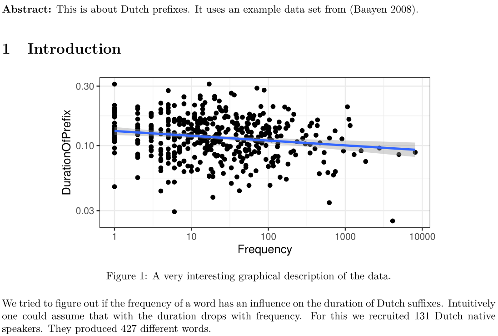

name: title-slide
class: inverse, center, middle

```{r setup, include=FALSE, cache=FALSE}
options(htmltools.dir.version = FALSE, crayon.enabled = TRUE)

library(crayon)
library(fansi)
library(dplyr)
library(ggplot2)
library(stargazer)
library(countdown)
library(RefManageR)
library(rmarkdown)
library(tinytex)
library(tidyverse)
library(knitr)
library(kableExtra)
library(bookdown)
library(blogdown)
library(shiny)
library(xaringan)
library(plotly) 
library(kableExtra)
# data
data("durationsGe", package = "languageR")
df <- read.csv("data/journals.csv") %>% 
      mutate(subfield = as.factor(subfield), 
             english = as.factor(english),
             age = 2020 - since) %>%
      select(-since)

# regression models
lm1 <- lm(h5_index ~ issues, data = df)
lm2 <- lm(h5_index ~ issues + english, data = df)
lm3 <- lm(h5_index ~ issues + english + subfield, data = df)
lm4 <- lm(h5_index ~ issues + english + subfield + age, data = df)

knitr::write_bib(file="packages.bib", prefix = "")

BibOptions(check.entries = FALSE,
           bib.style = "authoryear",
           cite.style = "authoryear",
           style = "markdown",
           hyperlink = T,
           max.names = 1,
           dashed = FALSE)->bo
mb <- ReadBib("packages.bib", check = FALSE)
ct <- function(key, bib=mb, opts=bo){
  Citet(bib=bib, key, .opts=opts)
}
cp <- function(key, bib=mb, opts=bo){
  Citep(bib=bib, key, .opts=opts)
}

doc1 <- "`01/dutchge-1.pdf`"
doc2 <- "`02/dutchge-2.pdf`"
doc3 <- "`03/dutchge-3.pdf`"
doc4 <- "`04/dutchge-4.pdf`"
doc5 <- "`05/dutchge-5.pdf`"
doc6 <- "`06/dutchge-6.pdf`"
doc7 <- "`07/dutchge-7.pdf`"
doc8 <- "`08/dutchge-8.pdf`"
doc9 <- "`09/dutchge-9.pdf`"
doc10 <- "`10/dutchge-10.pdf`"
doc11 <- "`11/dutchge-11.pdf`"
doc12 <- "`12/dutchge-12.pdf`"
doc13 <- "`13/dutchge-13.pdf`"
rmd1 <- "`14/variable-xrc.Rmd`"
xar1 <- "`X1/xar-1.html`"
xar2 <- "`X2/xar-2.html`"
xar3 <- "`X3/xar-3.html`"
xar4 <- "`X4/xar-4.html`"
xar5 <- "`X5/xar-5.html`"
xar6 <- "`X6/xar-6.html`"
xar7 <- "`X7/xar-7.html`"

knitr::opts_chunk$set(cache=T,
                      warning=F,
                      message=F)
```

<style type="text/css">

.hljs-github .hljs {
    background: #e5e5e5;
}

.inline-c, remark-inline-code {
   background: #e5e5e5;
   border-radius: 3px;
   padding: 4px;
   font-family: 'Source Code Pro', 'Lucida Console', Monaco, monospace;
}

.rightit {
text-align: right;
}

.yellow-h{
   background: #ffff88;
}


.out-t, remark-inline-code {
   background: #9fff9f;
   border-radius: 3px;
   padding: 4px;
   
}

.pull-left-c {
    float: left;
    width: 58%;
    
}

.pull-right-c {
    float: right;
    width: 38%;
    
}
.pull-right-d {
    float: right;
    width: 58%;
    
}

.medium {
    font-size: 75%
    
}

.small {
    font-size: 50%
    }

.action {
    background-color: #f2eecb;
}


.skipped {
    background-color: #eeeeee;
}


</style>

```{r, include=F, cache=FALSE}
datestring <- "6 May 2022"
timeframe <- "3 blocks of about 90 minutes each"
demologo <- "image/rueg2.png"
getex <- "getex_git.Rmd"
showgit <- F
showgaps <- F
showggplot <- F # it is very unlikely that you want to change that.
if(file.exists("config.R"))
  source("config.R")
```


# Writing Reproducible Research Papers with R Markdown

<br>

### [Felix Golcher](https://www.linguistik.hu-berlin.de/de/staff/golcherf) | [CRC 1412](https://sfb1412.hu-berlin.de/) | [INF](https://sfb1412.hu-berlin.de/projects/inf/)

### `r datestring`

.footnote[
[CC BY-SA 3.0](https://creativecommons.org/licenses/by-sa/3.0/) &nbsp;&nbsp;&nbsp;&nbsp;&nbsp;&nbsp;&nbsp;&nbsp;&nbsp;&nbsp;&nbsp;&nbsp;&nbsp;&nbsp;&nbsp;&nbsp;&nbsp;&nbsp;&nbsp;&nbsp;&nbsp;&nbsp;&nbsp;&nbsp;&nbsp;&nbsp;&nbsp;&nbsp;&nbsp;&nbsp;&nbsp;&nbsp;&nbsp;&nbsp;&nbsp;&nbsp;&nbsp;&nbsp;&nbsp;&nbsp;&nbsp;&nbsp;&nbsp;&nbsp;&nbsp;&nbsp;&nbsp;&nbsp;&nbsp;&nbsp;&nbsp;&nbsp;&nbsp;&nbsp;&nbsp;&nbsp;&nbsp;&nbsp;&nbsp;&nbsp;&nbsp;&nbsp;&nbsp;&nbsp;&nbsp;&nbsp;&nbsp;&nbsp;&nbsp;&nbsp;&nbsp;&nbsp;&nbsp;&nbsp;&nbsp;&nbsp;&nbsp;&nbsp;&nbsp;&nbsp;&nbsp;&nbsp;&nbsp;&nbsp;&nbsp;&nbsp;&nbsp;&nbsp;&nbsp;&nbsp;&nbsp;&nbsp;&nbsp;&nbsp;&nbsp;&nbsp;&nbsp;&nbsp;&nbsp;&nbsp;&nbsp;&nbsp;&nbsp;&nbsp;&nbsp;&nbsp;&nbsp;&nbsp;&nbsp;&nbsp;&nbsp; forked from [Resul Umit](https://resulumit.com/)'s [rmarkdown workshop](https://github.com/resulumit/rmd_workshop).
]

???

```{r, include=FALSE}
delta <- 5
tot <- delta
```


This slide alone make count to `r tot` min.

Talk about why we make this workshop.

Your experience in class.

---
class: center

## Where to find this presentation

```{r, echo = FALSE, out.width= "40%"}

```

[https://amor.cms.hu-berlin.de/~golchefe/rmd/rmd_workshop.html](https://amor.cms.hu-berlin.de/~golchefe/rmd/rmd_workshop.html)
---
## Assessing what you know

* Did you ever open rstudio?

--
* Do you know a little bit (or more) of R?

--
* Do you know (a bit or more) how to work with ggplot?

--
* Do you know how to do
  - headers, subheaders, subsubheaders in **Markdown**?
  - bold face, italics etc?
  - lists, numbered or bullets?

--
* Do you know what a chunk code is?

--
* Can you handle the most common code chunk options?
  - `echo`
  - `eval` etc?

--
* Can you fine tune the appearance of your figure code chunks?

--
* Can you work with `ref.label` and `child` documents?

--
* Can you invalidate the cache based upon changes in an external file?

--
* Do you write your own hooks (you might be of great help...)
---

## A normal situation

.pull-right-c[

]

.pull-left-c[
* Lets assume, you write an article. 
* There is text, there are Figures, there are numbers.
* You write the article in Word.
* The analysis is done in (an) R-script(s)
* You might have some collaborators.
* The deadline will be very soon...
]

--

.pull-left-c[
* **uuupsi**
    - We have to exclude 1 experimental subject.
    - All numbers have to change.
    - The figures will have to change as well.
]

???

Normal indeed.

I've seen that! Tell a story

! The article is obviously just a mock fragment to show the formal essence of an article.

---
name: findfigure

## Finding the right figure

The directory where all (really all?) of the figures are, looks like this:

.pull-right-c[
{{content}}
]

```
pictures/
├── dutch-1.png
├── dutch-2.png
├── dutch-3.png
├── final
│   ├── dutch-1.png
│   ├── dutch-2.png
│   └── dutch-4.png
├── final-2
│   ├── dutch-1.png
│   ├── dutch-2.png
│   └── dutch-3.png
└── obsolete
    ├── dutch-1.png
    ├── dutch-2.png
    ├── dutch-3.png
    ├── great.png
    └── not-so-great.png
```

**Which** is the right file?

???

Mention that this is a directory tree...


---
count: false
template: findfigure

Was it this one? 


`final/dutch-1.png`
---
count: false
template: findfigure

Or this one?


`final-2/dutch-3.png`

---
count: false
template: findfigure

Or that one? 


`dutch-1.png`


---

# We found the figure &mdash; How was it created?

.pull-left-c[
* If you created the image in a script, you *only* have to search all your scripts for that file name.
* If you used the "export" button in Rstudio, you have to find the place yourself.
* In any case you have to hope that the script did not change since then (**git it**).
* This is how your R-script might look: 🢂
]

--

.pull-right-c[

```{r, eval=FALSE}
durationsGe %>% as_tibble() %>% 
  ggplot(aes(cFrequency, 
             DurationOfPrefix))+
  geom_point()+
  scale_x_log10()+
  scale_y_log10()+
  geom_smooth(method=lm)+
  theme_bw()

durationsGe %>% as_tibble() %>% 
  ggplot(aes(Frequency, 
             DurationOfPrefix))+
  geom_point()+
  scale_x_log10()+
  geom_smooth(method=lm)+
  theme_bw()
```
]

--

**Which is the right version?**

???

What does it mean "to find the place yourself"?

---

# Adapting the numbers

* Did the p value change?
* Where was the p value actually computed?
    - in which script?
    - at which place?
    - We found it. Well, maybe.
        * In the article it says 0.00876
        * The script gives you 0.00871! What the heck is going on?
            - Is it really the right place?
            - Maybe a typo in the article?
            - The R-version changed?
            - We actually got the number from some**where??** else?

--

What is the right version again??
```{r, eval=FALSE}
m0 <- lme4(DurationOfPrefix ~ Frequency + (1|Speaker) + (1|Word), 
           durationsGe)
m2 <- lme4(DurationOfPrefix ~ Frequency + (0|Speaker) + (1|Word), 
           durationsGe)
m1 <- lme4(DurationOfPrefix ~ Frequency + (1|Speaker) + (Sex|Word), 
           durationsGe)
```

--

THE CLOCK IS TICKING. THE PAPER IS DUE. 

---
class: center

# The breaking point

* You found all figures and adapted all figures.
* You think you might have found all numbers. (you have not.)
* you think you have corrected all numbers. (do you? Really?)

--

🥳

--

A mail from your co-worker arrives. 

--

...


--

Word doc attached. 

--

...

--

She adapted the same figures and numbers.

--

...

--

Other figures, other numbers. Just slightly so.

--

💀

???

```{r, include=FALSE}
delta <- 17
tot <- tot + delta
```

estimate $\Delta$ `r delta`, total `r tot` min. Experience. The story takes time to tell.

---
name: md1
# A better world exists

* A RMarkdown document is a text file that mixes descriptive text with R code.
* It can be converted to numerous output formats (PDF, docx, you name it)
* Figures and numbers are directly inserted.

.pull-left-c[

{{content}}

]

.pull-right-c[

In our example you only had to insert the line

```{r, eval=F}
durationsGe <- durationsGe %>% 
  filter(Speaker != "N01033")
```

Then recompile.
]


---
count: false
template: md1

```{r, echo = FALSE, out.width = "100%"}

```

the source

---
count: false
template: md1

```{r, echo = FALSE, out.width = "85%"}

```

the result

---
count: false
template: md1

```{r, echo = FALSE, out.width = "100%"}

```

the modified source

---
count: false
template: md1

```{r, echo = FALSE, out.width = "85%"}

```

the modified result

???

```{r, include=FALSE}
delta <- 3
tot <- tot + delta
```

estimate $\Delta$ `r delta`, total `r tot` min.

---


## R Markdown &mdash; Why would you want to use it?

- Efficient

   - Combining analysis and text streamlines the thought process.
   - The whole workflow in one work environment (Rstudio)
   - **No** cut'n'paste any more
       - Decreases the possibility of making mistakes in the process.
       - Each bit of the article is easily tracable.
       - Consequences of subtle changes propagate everywhere by themselves.
   - Markdown much easier to learn than $\LaTeX$. Same workflow exists for $\LaTeX$. Even more powerful.

--

- Flexible
    - output to various file formats
        - e.g., HTML, $\LaTeX$, PDF, Word ([caveat](https://twitter.com/patilindrajeets/status/1395298790647771136))
        - that is the *same* source gives different formats.
        - predefined templates/styles exist
    - output to different modalities
        - articles
        - presentations like this one
        - [interactive documents](https://shiny.rstudio.com/) 
        
???

The caveat

Indrajeet Patil
@patilindrajeets

Although #rmarkdown creates all sorts of outputs, not everything will work across outputs. E.g. I love including gifs in docs. This works in HTML but fails when knitted to PDF.

✅ How can one make doc robust to multiple outputs?

--

- Collaboration: As a text based format, (R)Mardown is ideal for versioning, e.g. using git.


???

```{r, include=FALSE}
delta <- 2
tot <- tot + delta
```

estimate $\Delta$ `r delta`, total `r tot` min.

---

# Extra reason 1: keep it complete!

> There’s nothing worse than discovering three months after the fact that you’ve only stored the results of an important calculation in your workspace, not the calculation itself in your code.
> .rightit[ 
[Hadley Wickham](https://r4ds.had.co.nz/workflow-projects.html) ]

--

**If** you have an RMarkdown document, and **if** you make sure it compiles...

--

... **then** that cannot happen.


---

# Extra reason 2: It's even scriptable &mdash; Use case

**The Problem**

* You test 471 children in their language abilities.
* After the results are in you want (and promised) to notify the parents.
* Doing that manually...
    - ... takes a lot of time
    - ... is guaranteed to produce errors.
    - Those are very hard to find.
    - You don't want to report false results to the parents, do you?

--

**The Solution**

* You write *one* RMarkdown-document.
* This produces the report for _one_ child.
* The child's ID is given as a variable.
* You loop through all children.
* You have 471 reports for 471 children from _one_ source document.

---

## Extra reason 3: Reproducibilty &mdash; After Publication

- After your paper is published, others, including your future self, might like to check your results:

    - Are the correct numbers in the correct context?
    - What exactly was done?
        - Which models were computed?
        - With exactly which parameters?
    - What subgroups/data might have been excluded from the analysis? Correctly so?
    
--

- In the traditional approach this is impossible even if the data are public:
    - You cannot describe what you did so detailed that someone else can reproduce a non-trivial analysis.
    
--

- In an RMarkdown based workflow this is easy:
    - Everything is there.

???

```{r, include=FALSE}
delta <- 4
tot <- tot + delta
```

estimate $\Delta$ `r delta`, total `r tot` min.

---
## The Workshop &mdash; Overview

- `r timeframe`, on how to write reproducible research papers with R Markdown

  - A lot of slides, a lot of exercises

--

- Based on back engineering RMarkdown from `PDF`s provided to you.

  - (If we make it there) improving its reproducibility and version-controlling it
  - with a PDF output in mind
      - default is HTML
      - Papers or theses are usually not submitted as HTML

--

- Designed for researchers with basic knowledge of R programming language

  - does not cover programming with R
      - e.g., writing functions    
  - ability to regress, plot, and table in R will be very helpful
      - but not absolutely necessary &mdash; these skills are kindof independent.
  - **If you get stuck because of R problems I will provide you the code. Just ask**
        
---
## The Workshop &mdash; Contents

<!--
see https://github.com/yihui/xaringan/issues/217
for a discussion on table of contents in xaringan.
For the numbers of the parts we could introduce counters.
I won't do that now, but as it is it will be double numbers
if the configured-off parts are included again.
The labels should get mnemonic names.
-->

.pull-left[

[Part 1. Getting the Tools Ready](#part1)
   - e.g., downloading course material

[Part 2. Introducing R Markdown](#part2)
   - e.g., creating a new document

[Part 3. Setting Metadata](#part3)
   - e.g., defining output format

[Part 4. Writing Text](#part4)
   - e.g., adding emphasis to text

[Part 5. Managing References](#part5)
   - e.g., citing sources
   
]

--
name: contents-slide

.pull-right[

[Part 6. The R of Rmarkdown](#part6)
   - Code Chunks and Inline Code

[Part 7. Code chunks with figures](#part7)
   - half and fully dynamic

[Part 8. Code chunks with tables](#part8)
   - the `stargazer` package

[Part 9. Reusing code chunks](#part9)
   - the `ref.label` option

[Part 10. lookout and outlook](#part10)
   - What else we could learn

`r if(!showgaps)"<!--"`

[Part 10. Addressing Functionality Gaps](#part10)
   - e.g., adjusting line spacing

`r if(!showgaps)"-->"`


<!-- conditional child doc would not be that transparent. -->

`r if(!showgit)"<!--"`

[Part 11. Using Version Control](#part11)
   - e.g., integrating Git and GitHub

[Part 12. Collaborating with Others](#part12)
   - e.g., working simultaneously with co-authors

`r if(!showgit)"-->"`

]
---
## The Workshop &mdash; Organisation

- We will (often) work in groups of (around) 3 to 4 people.

  - participants learn as much from their partner as from instructors
  - from time to time those will be rearranged.

- You will create your own RMarkdown document(s), not edit something I provide.

  - typing and doing it yourself is a part of the learning process

- When you have a question

  - ask your partner
  - google together
  - call me and I will happily help

---
class: action

## The Workshop &mdash; Organisation &mdash; Slides

Slides with this background colour indicate that your action is required, for

- setting the workshop up
    - e.g., downloading course material 
    
- completing the exercises
    - e.g., managing references in R Markdown
    - these slides (usually) have countdown timers
    
    
`r countdown(minutes = 3, seconds = 00, top = 0)`

---


## The Workshop &mdash; Organisation &mdash; Slides

- Codes and texts that go in R Markdown documents .inline-c[appear as such &mdash; in a different font, on gray background]
    - long codes and texts will have their own line(s)

```{r, eval=FALSE}
ggplot(data = df, mapping = aes(x = h5_median, y = h5_index, color = subfield)) +
       geom_point() +
       facet_wrap(. ~ branch) +
       scale_colour_discrete(name = "Journal Type", breaks = c(0, 1),
                             labels = c("Generalist", "Subfield"))    
```

---
## The Workshop &mdash; Organisation &mdash; Slides

- Codes and texts that go in R Markdown documents .inline-c[appear as such &mdash; in a different font, on gray background]
    - long codes and texts will have their own line(s)

- Results that come out in output files .out-t[appear as such &mdash; in the same font, on green background]
    - except very obvious results, such as figures and tables
    
--
    
- Specific sections are .yellow-h[highlighted yellow as such] for emphasis
    - these could be for anything &mdash; codes and texts in input, results in output, and/or texts on slides
    
--

- The slides are designed for self-study as much as for the workshop
    - *accessible*, in substance and form, to go through on your own

---
## The Workshop &mdash; Aims

- To make you aware of what is possible with R Markdown

  - we will cover a large breadth of issues, not all of it is for long-term memory
      - one reason why the slides are designed for self study as well    
<br>
  - awareness of what is possible, `Google`, and perseverance are all we need.

--

- To encourage you to move to R Markdown 

  - Having practiced lowers the threshold of actually using it.
  - Having understood the power of it raises motivation.
    

```{r, include=FALSE}
delta <- 5
tot <- tot + delta
```

---
name: part1
class: inverse, center, middle

# Part 1. Getting the Tools Ready

.footnote[

[Back to the contents slide](#contents-slide).

]

```{r, child=getex}
```

---
class: action

## R Markdown Cheat Sheet &mdash; Download from the Internet

Downloading process can be initiated from within RStudio

- follow from the RStudio menu

> `Help -> Cheatsheets -> R Markdown Cheat Sheet` 


???

```{r, include=FALSE}
delta <- 2
tot <- tot + delta
```

estimate $\Delta$ `r delta`, total `r tot` min.

---
## Other Resources<sup>*</sup>

- R Markdown: The Definitive Guide (Xie et al., 2019)

   - open access at [https://bookdown.org/yihui/rmarkdown](https://bookdown.org/yihui/rmarkdown/)
    

- R for Data Science (Wickham and Grolemund, 2019)
  
   - open access at [https://r4ds.had.co.nz](https://r4ds.had.co.nz/)
- Pandoc User's Guide

   - available at [https://pandoc.org/MANUAL.html](https://pandoc.org/MANUAL.html)

   
.footnote[

<sup>*</sup> During the workshop, R Markdown Cheat Sheet is likely to be more helpful than these resources, which I recommend to be consulted after the workshop.

]

???

```{r, include=FALSE}
delta <- 1
tot <- tot + delta
```

estimate $\Delta$ `r delta`, total `r tot` min.

---
name: part2
class: inverse, center, middle

# Part 2. Introducing R Markdown

.footnote[

[Back to the contents slide](#contents-slide).

]

---
class: action

## R Markdown Document &mdash; Create from within RStudio

- Create a new R Markdown document from the RStudio menu:<sup>*</sup> 

> `File -> New File -> R Markdown -> OK`

- Save your new document:

> `File -> Save`

- I recommend to use a fresh directory to save the file in. (e.g. `rmd_workshop`)
    - usually an RMarkdown script represents a statistical analysis.
    - There might data. They would go in something like `rmd_workshop/data`
    - There might be additional images, e.g. in `rmd_workshop/images`
    - Maybe other files like bibliography style files.
- If you put everything in subfolders below your Rmd-file you can (and all still works the same: ✅)
    - zip it and share it
    - push it to git as is
    - move it around on your computer(s)

- Observe that your file automatically got the extension `.Rmd`.

???

Mention what happens, if you don't

Mention Rstudio projects

```{r, include=FALSE}
delta <- 5
tot <- tot + delta
```

estimate $\Delta$ `r delta`, total `r tot` min.

---
## R Markdown Document &mdash; Components

* What you get is a predefined template. 
* The document has three components

--

.pull-left-c[

* **YAML**: 
  - Meta information and 
  - processing instructions 
  - in a nested key-value-scheme.

]

.pull-right-c[


]

--

.pull-left-c[

* **text**: 
  - Human readable. 
  - Peppered with basic formatting information. 
  - the **Markdown** part of R**Markdown**

]

.pull-right-c[


]

<br>

--

.pull-left-c[

* **code chunks**: 
  - regions framed by special tags containing R code. 
  - the **R**part of **R**Markdown

]

.pull-right-c[    


]

???

```{r, include=FALSE}
delta <- 3
tot <- tot + delta
```

estimate $\Delta$ `r delta`, total `r tot` min.

---
class: action

## R Markdown Document &mdash; Compile

.pull-left-c[
- Click the `Knit` button to compile
  - An output document pops up in another window (or similar things happen)
  - You find this new document in the directory you placed the Rmd in.
  - the output document has the same base name as your `.Rmd` document
  - the extension should be `.html` by default.
]
.pull-right-c[

```{r, echo = FALSE, out.width = "95%"}

```

]

--

.pull-left-c[
* Click the ▼ to the right of the `Knit` button
  - choose "knit to pdf" from the appearing dropdown.
  - A `PDF` viewer should pop up
  - if you get an error about a missing $\LaTeX$ installation:
    - install `tinytex` `r cp("tinytex")`
```{r eval=FALSE, tidy=FALSE}
install.packages(c("rmarkdown"))
tinytex::install_tinytex()
```
* For the remainder of the course we will focus on PDF.

]

???

```{r, include=FALSE}
delta <- 5
tot <- tot + delta
```

estimate $\Delta$ `r delta`, total `r tot` min. (Hard to say becaus of this installation)

```{r, include=FALSE}
delta <- 5
tot <- tot + delta
```

break $\Delta$ `r delta`, total `r tot` min.


---
## R Markdown Document &mdash; Compilation Process 

- When you `Knit`, the following happens: 

**`.Rmd`** (RMarkdown) $\xrightarrow[\text{runs R code}]{\text{knitr}}$ **`.md`** (Markdown) $\xrightarrow[\text{converts}]{\text{pandoc}}$ whatevery **output** form and format you desire!

- `knitr`
     - is an R package, a central and powerful one.
     - executes the code chunks
     - optionally replacing it with the results 
     - pure `.md` (Markdown) remains.

- `pandoc` transforms the .md document into your preferred output format(s)
     - is **not** an R package, but a standalone conversion wonder program
     - e.g., HTML, $\LaTeX$, PDF, Word
     - RStudio comes with a copy of `pandoc` ([http://pandoc.org](http://pandoc.org)), so you do not have to install it separately. 

- This process is automated by the `rmarkdown` package


---
## R Markdown Document &mdash; Notes

- Behind the scenes, each `.Rmd` file is compiled in its own session, and therefore

  - the code needs to stand alone, for reproducibility reasons
  - you might have already loaded a package and/or imported data elsewhere (e.g., in a separate .R and/or .Rmd file), but even in the same session, these won't be available to a given .Rmd file

--

- R Markdown can produce more than scientific reports,<sup>*</sup> including
  - presentations, for example with `xaringan`  `r cp("xaringan")`, like this one
  - books, with `bookdown` `r cp("bookdown")`
  - websites, with `blogdown` `r cp("blogdown")`
  - interactive web applications, with `shiny` `r cp("shiny")`
* Here we will focus mostly on research papers, maybe with a digression to presentations.

---
## How to use and how not to use RMarkdown files

* Rmarkdown mixes text and code.
* The code (besides what it does as code itself, like writing files or whatever) produces output.
* This output is filtered in a completely customizable manner
* and inserted in, around, and between the plain text.
* Further processing can transform the result in
  - a website
  - a fully publishable research article
  - whatever

--

Often people do not really use this workflow. We have RMarkdown docs that are...

* Not written with _any_ audience in mind (not even myself)
* Not written with _any_ end result in mind.
  - In paralell some article might be written in another format.
* Used exclusively interactively
  - just like an normal R-script.
* Never compiled.

--

In this way, you forsake all the power this format gives you. All you get is an extra cluttered R-script.

--

> Compile often, get rid of errors at once and check the result!

---
name: part3
class: inverse, center, middle

# Part 3. Setting Metadata

.footnote[

[Back to the contents slide](#contents-slide).

]

???

```{r, include=FALSE}
delta <- 3
tot <- tot + delta
```

estimate $\Delta$ `r delta`, total `r tot` min.

---
## YAML &mdash; Overview

`.Rmd` documents start<sup>*</sup> with YAML
- it includes the metadata variables
    - e.g., title, output format    
<br>    
- it is written between a pair of three hyphens .yellow-h[-]

```{r, eval = FALSE}
---
title: 
output:
---
```


.footnote[

<sup>*</sup> Technically, we can place YAML anywhere in a .Rmd document. However, it is a good practice to start with YAML so that the metadata is easly accessbile.

]

---
## YAML &mdash; Variables

- `title` and `output` are the basic variables of YAML
    - variable names are typed in lower case, followed by a colon <span style="background-color: #ffff88;">:</span>
<br>
    - the list of available variables, as well as options and sub-options for these variables, depends on the output format
       - [Pandoc User's Guide](https://pandoc.org/MANUAL.html) provides a comprehensive documentation
       - R Markdown Cheat Sheet provides a helpful list

- Typical YAML variables for an research paper:

```{r, eval = FALSE}
---
title: 
author: 
date: 
bibliography: 
csl: 
output: 
---
```

---
## YAML &mdash; Variables

Variables can take .yellow-h[strings]

```{r, eval = FALSE}
---
title: "Journals: Random Words With Random Data" #<<
output:
---
```

---
## YAML &mdash; Variables

Variables can take strings, .yellow-h[options]

```{r, eval = FALSE}
---
title: "Journals: Random Words With Random Data" 
output: pdf_document                                  #<<
---
```

---
## YAML &mdash; Variables

Variables can take strings, options, .yellow-h[sub-options]

```{r, eval = FALSE}
---
title: "Journals: Random Words With Random Data" 
output: 
    pdf_document:
        keep_tex: true                   #<<
---
```

---
## YAML &mdash; Variables

Variables can take strings, options, sub-options, and .yellow-h[code]

```{r, eval = FALSE}
---
title: "Journals: Random Words With Random Data" 
date: "\`r format(Sys.Date(), '%d %B %Y')`"      #<<
output: 
    pdf_document:
        keep_tex: true                    
---
```

---
## YAML &mdash; Variables &mdash; Output Formats

.pull-left-c[

Documents as output formats include

- .yellow-h[HTML]
    
```{r, eval = FALSE}
---
title: "Journals: Random Words With Random Data" 
output: html_document #<<
---
```  
]    

.pull-right-c[

```{r, echo = FALSE, out.width = "95%"}

```

]

---
## YAML &mdash; Variables &mdash; Output Formats

.pull-left-c[

Documents as output formats include

- HTML
- .yellow-h[LaTeX] <!-- \LaTeX produces strange errors here. -->
    
```{r, eval = FALSE}
---
title: "Journals: Random Words With Random Data" 
output: latex_document #<<
---
```  
]    

.pull-right-c[

```{r, echo = FALSE, out.width = "95%"}

```

]

---
## YAML &mdash; Variables &mdash; Output Formats

.pull-left[

Documents as output formats include

- HTML
- $\LaTeX$
- .yellow-h[`PDF`]
    
```{r, eval = FALSE}
---
title: "Journals: Random Words With Random Data" 
output: pdf_document #<<
---
```  
]    

.pull-right-c[

```{r, echo = FALSE, out.width = "95%"}

```

]

---
## YAML &mdash; Variables &mdash; Output Formats

.pull-left-c[

Documents as output formats include

- HTML
- $\LaTeX$
- PDF
- .yellow-h[Word]
    
```{r, eval = FALSE}
---
title: "Journals: Random Words With Random Data" 
output: word_document #<<
---
```  
]    

.pull-right-c[

```{r, echo = FALSE, out.width = "95%"}
knitr::include_graphics("image/yaml_word.png")
```

]

---
## YAML &mdash; Variables &mdash; Output Formats

.pull-left[

- Documents as output formats

  - `html_document`
  - `latex_document`
  - `pdf_document`<sup>*</sup>
  - `word_document`
  - `github_document`
  - `md_document`
  - `odt_document`
  - `rtf_document`

]
    
.pull-right-c[ 

- Presentations as output formats

  - `beamer_presentation`
  - `iosslides_presentation`
  - `powerpoint_presentation`
  - `slidy_presentation`

]    

.footnote[

<sup>*</sup> For reasons of simplicity, this workshop focuses on $\LaTeX$ and/or PDF outputs. Different output formats have slightly different customisations. See [Pandoc User's Guide](https://pandoc.org/MANUAL.html) and/or R Markdown Cheat Sheet.

]

---
## YAML &mdash; Strings

.pull-left-c[

Strings with special characters, such as colon, require quotation marks .yellow-h["] or .yellow-h[']

```{r, eval = FALSE}
---
title: "Journals: Random Words With Random Data" #<<
output: pdf_document                                  
---
```

]

.pull-right-c[

```{r, echo = FALSE, out.width = "95%"}

```

]

---
## YAML &mdash; Strings

.pull-left-c[

Quotation marks are optional for strings without special characters

```{r, eval = FALSE}
---
title: "Journals: Random Words With Random Data" 
subtitle: A Mock Paper for an R Markdown Workshop #<<
author: Jane Doe                                  #<<
date: 4 March 2020                                #<<
output: pdf_document                                  
---
```
]

.pull-right-c[

```{r, echo = FALSE, out.width = "95%"}

```

]

---
## YAML &mdash; Strings

.pull-left-c[

The syntax .inline-c[^[footnotes_go_here]] adds footnotes to strings

```{r, eval = FALSE}
---
title: "Journals: Random Words With Random Data^[Preliminary draft. Please do not cite or circulate without permission from the author.]" #<<
subtitle: A Mock Paper for an R Markdown Workshop
author: "Jane Doe^[Department of Science, University of Random. Email: jane.doe@random.edu. Website: http://www.janedoe.com.]"                                    #<<
date: 4 March 2020                                
output: pdf_document                                    
---
```

]

.pull-right-c[

```{r, echo = FALSE, out.width = "95%"}

```

]

---
## YAML &mdash; Strings

The `bibliography` and `csl` variables take strings as well

```{r, eval = FALSE}
---
title: "Journals: Random Words With Random Data^[Preliminary draft. Please do not cite or circulate without permission from the author.]"
subtitle: A Mock Paper for an R Markdown Workshop
author: "Jane Doe^[Department of Science, University of Random. Email: jane.doe@random.edu. Website: http://www.janedoe.com.]"                                    
date: 4 May 2020 
bibliography: references.bib   #<<
csl: apa_7th.csl               #<<  
output: pdf_document                                    
---
```

---
## YAML &mdash; Strings

```{r, eval = FALSE}
---
...
bibliography: references/ref_library.bib                                               #<<
csl: /home/flx/hu/statistik/register/rmd_workshop/manuscript/apa_7th.csl     #<<
...
---
```

Those strings can be

* *relative* paths like `references/ref_library.bib`. With RMarkdown they start in the directory where the script resides.
* *absolute* paths, starting at the directory tree root like 
  * `/home/flx/hu/statistik/register/rmd_workshop/manuscript/apa_7th.csl` (Linux/Mac) or 
  * `C:\Users\you\Documents\style.css` (Windows)

But **never ever** use absolute paths in an RMarkdown document

* otherwise you cannot share it
* **why?** No one will have exactly your directory structure as you.
???

We already mentioned something similar: Self contained directories.

---
## YAML &mdash; Options and Sub-Options

.pull-left-c[

Options can have sub-options

```{r, eval = FALSE}
---
title: "Journals: Random Words With Random Data^[Preliminary draft. Please do not cite or circulate without permission from the author.]"
subtitle: A Mock Paper for an R Markdown Workshop
author: "Jane Doe^[Department of Science, University of Random. Email: jane.doe@random.edu. Website: http://www.janedoe.com.]"
date: 4 March 2020  
bibliography: references.bib
csl: apa_7th.csl   
output:                   #<<
    pdf_document:         #<<
        keep_tex: true    #<<
---
```

]

.pull-right-c[

```{r, echo = FALSE, out.width = "100%"}

```

]

---
## YAML &mdash; Options and Sub-Options

.pull-left[

Options can have sub-options

```{r, eval = FALSE}
---
title: "Journals: Random Words With Random Data^[Preliminary draft. Please do not cite or circulate without permission from the author.]"
subtitle: A Mock Paper for an R Markdown Workshop
author: "Jane Doe^[Department of Science, University of Random. Email: jane.doe@random.edu. Website: http://www.janedoe.com.]"                                    
date: 4 March 2020  
bibliography: references.bib
csl: apa_7th.csl   
output:                   #<<
    pdf_document:         #<<
        keep_tex: true    #<<
---
```

]

.pull-right[

Notice that

- this specific setting, highlighted, will create multiple outputs
    - a $\LaTeX$ and a PDF document

- all but the last option (i.e., `true`) takes a colon

- options and sub-options (except the last option, again) are stepwise indented 
   - exactly with four spaces
   - the alignment between the colons for `pdf_document` and `keep_tex` is coincidental 

]

---
## YAML &mdash; R Code

.pull-left-c[

Variables can take code as well

```{r, eval = FALSE}
---
title: "Journals: Random Words With Random Data^[Preliminary draft. Please do not cite or circulate without permission from the author.]"
subtitle: A Mock Paper for an R Markdown Workshop
author: "Jane Doe^[Department of Science, University of Random. Email: jane.doe@random.edu. Website: http://www.janedoe.com.]"
date: "\`r format(Sys.Date(), '%d %B %Y')`"  #<<
bibliography: references.bib
csl: apa_7th.csl   
output: pdf_document
---
```

]

.pull-right-c[

```{r, echo = FALSE, out.width = "95%"}

```

]

---
## YAML &mdash; R Code

.pull-left[

Variables can take code as well

```{r, eval = FALSE}
---
title: "Journals: Random Words With Random Data^[Preliminary draft. Please do not cite or circulate without permission from the author.]"
subtitle: A Mock Paper for an R Markdown Workshop
author: "Jane Doe^[Department of Science, University of Random. Email: jane.doe@random.edu. Website: http://www.janedoe.com.]"
date: "\`r format(Sys.Date(), '%d %B %Y')`"  #<<
bibliography: references.bib
csl: apa_7th.csl   
output: pdf_document
---
```

]

.pull-right[

Notice that

- such codes can be particularly useful for variables 
    - that need frequent updates
    - and that can be automatically updated
        - e.g., `date`

- there are quotation marks around the code

- we'll cover codes in .Rmd documents later on in the workshop

]

**Remark**

* The strange quotation mark like things around the code .yellow-h["&#96;"] are called "backticks".
* They are usually only used as *grave accent*.
* How to find?
  - German QWERTY: upper right corner
  - American QWERTY: upper left corner

---
## YAML &mdash; R Code

.pull-left-c[

Code and text can be combined in a string

```{r, eval = FALSE}
---
title: "Journals: Random Words With Random Data^[Preliminary draft. Please do not cite or circulate without permission from the author.]"
subtitle: A Mock Paper for an R Markdown Workshop
author: "Jane Doe^[Department of Science, University of Random. Email: jane.doe@random.edu. Website: http://www.janedoe.com.]"
date: "First version: 4 March 2020. This version: \`r format(Sys.Date(), '%d %B %Y')`."  #<<
bibliography: references.bib
csl: apa_7th.csl   
output: pdf_document
---
```

**Remark** (repeat)

* The strange quotation mark like things around the code .yellow-h["&#96;"] are called "backticks".
* They are usually only used as *grave accent*.
* How to find?
  - German QWERTY: upper right corner
  - American QWERTY: upper left corner


]

.pull-right-c[

```{r, echo = FALSE, out.width = "95%"}

```

]

---
name: yaml-further-settings

## YAML &mdash; Some Further Settings for PDF Outputs

- `fontsize`
    - the default is `10pt`
    - the other options are `11pt` and `12pt`
    
- `linkcolor`, `urlcolor`, `citecolor`
    - the default is the colour of the text
    - the other options are white, red, green, blue, cyan, magenta, yellow

- `link-citations`
    - the default is `no`
    - the other option is `yes` &mdash; a click on an citation will take the screen to the relevant entry in the list of references

---
class: action

## Exercise

1. Open your `Rmd` file and fill in the YAML variables for the mock paper
2. Compile to `PDF`
3. Cycle through 1. and 2. until your `PDF` reproduces `r doc1` as closely as possible.
    - Use an author name of your liking.
    - Make sure to remove the table of contents.
    - Pay attention to the font size.
    - Make the date string dynamic. R hint:
```{r}
Sys.Date()
```

Getting help:

* Ask your group mates
* Google
* Don't hesitate to call me in.

The task description is added to `r doc1` as well.

`r countdown(minutes = 10, seconds = 00, top = 0)`

???

```{r, include=FALSE}
delta <- 10
tot <- tot + delta
```

estimate $\Delta$ `r delta`, total `r tot` min.

```{r, include=FALSE}
delta <- 5
tot <- tot + delta
```

solution $\Delta$ `r delta`, total `r tot` min.


---
name: part4
class: inverse, center, middle

# Part 4. Writing Text

.footnote[

[Back to the contents slide](#contents-slide).

]

---
## Syntax &mdash; Overview

- R Markdown follows the syntax in Pandoc's Markdown 
   - That is quite important, since Markdown is not fully defined as `HTML` or `PDF`.   
   - for the complete rules of the syntax, see [Pandoc User's Guide](https://pandoc.org/MANUAL.html)
   - for a useful summary of the syntax, see the R Markdown Cheat Sheet
- Well, this document is done with `xaringan` `r cp("xaringan")`, which does not follow pandoc's syntax.
   - Version incompatibilities and caveats are quite common with markdown.
   - We will here (mostly?) learn things which are common to all things markdown.

---
## Syntax &mdash; Lines

Multiple spaces on a given line are reduced to one:

```{r eval = FALSE}
This is a sentence followed by four spaces.    This is another sentence on the same line.
```

.out-t[This is a sentence followed by four spaces.    This is another sentence on the same line.]

Line endings with fewer than two spaces are ignored:

```{r eval = FALSE}
It is generally no bad idea to put each sentence on a new line.
The output text does not show the line breaks.
But versioning programs like git work on a line by line basis.
By dividing the text into more than one line per paragraph we avoid conflicts.
```

.out-t[It is generally no bad idea to put each sentence on a new line.
The output text does not show the line breaks.
But versioning programs like git work on a line by line basis.
By dividing the text into more than one line per paragraph we avoid conflicts.
]

---
## Syntax &mdash; Hard Breakes

* Two or more spaces at the end of lines 
* or the tag `<br>` (for `html`) / `\newline` (for $\LaTeX$)

introduce hard brakes, forcing a new line

```{r eval = FALSE}
This is a sentence followed by two spaces.`  `
This is another sentence on a new line.<br>
This is another sentence on another line.
```

.out-t[This is a sentence followed by two spaces.  
This is another sentence on a new line.<br>
This is another sentence on another line.
]

---
## Syntax &mdash; Line Blocks

Spaces in lines starting with a vertical line .yellow-h[|] are kept

```{r eval = FALSE}
| a one-space indent
|     a five-space indent
|          a ten-space indent  
```

.out-t[

&nbsp;a one-space indent  
&nbsp;&nbsp;&nbsp;&nbsp;&nbsp;a five-space indent  
&nbsp;&nbsp;&nbsp;&nbsp;&nbsp;&nbsp;&nbsp;&nbsp;&nbsp;&nbsp;a ten-space indent  

]

---
## Syntax &mdash; Block Quotes

Lines starting with the greater-than sign .yellow-h[&#62;] introduce block quotes

```{r, eval=FALSE}
> In God, we trust. All others must bring data. 
>
> --- Anonymous 

```

.out-t[

&nbsp;&nbsp;&nbsp;&nbsp;&nbsp;&nbsp;&nbsp;&nbsp;In God, we trust. All others must bring data.    
&nbsp;&nbsp;&nbsp;&nbsp;&nbsp;&nbsp;&nbsp;&nbsp;    
&nbsp;&nbsp;&nbsp;&nbsp;&nbsp;&nbsp;&nbsp;&nbsp; &mdash; Anonymous
]
---
## Syntax &mdash; Paragraphs

One or more<sup>*</sup> blank lines introduce a new paragraph

```{r eval = FALSE}

This is the first sentence of a paragraph as it is preceded by a blank line. This is the second 
sentence of that paragraph, which is followed by a blank line. 

This is the first sentence of a *new paragraph* as it is preceded by a blank line. This is the 
second sentence of that paragraph, which is followed by a blank line.

```

.out-t[

This is the first sentence of a paragraph as it is preceded by a blank line. This is the second 
sentence of that paragraph, which is followed by a blank line.

This is the first sentence of a *new paragraph* as it is preceded by a blank line. This is the 
second sentence of that paragraph, which is followed by a blank line.

]

.footnote[

<sup>*</sup> Multiple blank lines between paragraphs reduce to one.

]

---
## Syntax &mdash; Comments

Text with the syntax .inline-c[<!--].inline-c[comments -->] is omitted from output

```md
<!-- This paragraph needs re-writing -->
This is the first sentence of a paragraph as it is preceded by a blank line. This is the second 
sentence of that paragraph, which is followed by a blank line. 

This is the first sentence of a new paragraph <!-- I've removed italics --> as it is preceded 
by a blank line. This is the second sentence of that paragraph, which is followed by a blank 
line. 

```

.out-t[

This is the first sentence of a paragraph as it is preceded by a blank line. This is the second 
sentence of that paragraph, which is followed by a blank line.

This is the first sentence of a new paragraph as it is preceded by a blank line. This is the 
second sentence of that paragraph, which is followed by a blank line.

]
???

```{r, include=FALSE}
delta <- 5
tot <- tot + delta
```

estimate $\Delta$ `r delta`, total `r tot` min. (7 slides, but short ones)

---
class: action

## Exercise

Update your `Rmd` file so the output matches `r doc2`.

* Avoid very long lines by putting one sentence per line.
* Pay attention to line breaks and paragraph endings.
* Add a comment. You can complain about everything, no one will see it.

`r countdown(minutes = 5, seconds = 00, top = 0)`  

???

```{r, include=FALSE}
delta <- 5
tot <- tot + delta
```

estimate $\Delta$ `r delta`, total `r tot` min. (2nd ex, less time)

```{r, include=FALSE}
delta <- 5
tot <- tot + delta
```

solution $\Delta$ `r delta`, total `r tot` min.

---
## Syntax &mdash; Headers

The number sign .yellow-h[&#x23;] introduces headers; lower levels are created with additional signs &mdash; up to total five levels

.pull-left[

.inline-c[&#x23; Introduction] becomes

.out-t[

# Introduction

]

.inline-c[&#x23;&#x23; 1. Research Review] becomes

.out-t[

## 1. Research Review

]

]

.pull-right[

.inline-c[&#x23;&#x23;&#x23; 3.1.2 Materials] becomes

.out-t[

### 3.1.2 Materials

]

.inline-c[&#x23;&#x23;&#x23;&#x23; 4th order subsection] becomes

.out-t[

#### 4th order subsection

]

.inline-c[&#x23;&#x23;&#x23;&#x23;&#x23; 5th order subsection] becomes

.out-t[

##### 5th order subsection

]

]

???

How the headers are actually rendered heavily depends on the output format.

* HTML: usually no auto numbering
* PDF: usually auto numbering of everything

---
## Syntax &mdash; Emphases 

* A pair of single asterisk .yellow-h[&#42;] or underscores .yellow-h[&#95;] introduces italics

<span style="background-color: #e5e5e5; border-radius: 3px; padding: 4px; font-family: 'Source Code Pro', 'Lucida Console', Monaco, monospace;">&#42;italics&#42;</span> becomes .out-t[*italics*]    

<span style="background-color: #e5e5e5; border-radius: 3px; padding: 4px; font-family: 'Source Code Pro', 'Lucida Console', Monaco, monospace;">&#95;italics&#95;</span> becomes .out-t[*italics*] as well


* A pair of double asterisk or underscores introduces bold  

<span style="background-color: #e5e5e5; border-radius: 3px; padding: 4px; font-family: 'Source Code Pro', 'Lucida Console', Monaco, monospace;">&#42;&#42;bold&#42;&#42;</span> becomes .out-t[**bold**]

<span style="background-color: #e5e5e5; border-radius: 3px; padding: 4px; font-family: 'Source Code Pro', 'Lucida Console', Monaco, monospace;">&#95;&#95;bold&#95;&#95;</span> becomes .out-t[**bold**] as well

* These two rules can be combined

<span style="background-color: #e5e5e5; border-radius: 3px; padding: 4px; font-family: 'Source Code Pro', 'Lucida Console', Monaco, monospace;">&#42;&#42;&#95;bolditalics&#95;&#42;&#42;</span> becomes .out-t[**_bolditalics_**]

<span style="background-color: #e5e5e5; border-radius: 3px; padding: 4px; font-family: 'Source Code Pro', 'Lucida Console', Monaco, monospace;">&#95;&#42;&#42;bolditalics&#42;&#42;&#95;</span> becomes .out-t[_**bolditalics**_]  as well

* Typewriter font (inline code, file names, R package names, etc) 

<span style="background-color: #e5e5e5; border-radius: 3px; padding: 4px; font-family: 'Source Code Pro', 'Lucida Console', Monaco, monospace;">&#96;package</span><span style="background-color: #e5e5e5; border-radius: 3px; padding: 4px; font-family: 'Source Code Pro', 'Lucida Console', Monaco, monospace;">&#96;</span> becomes .out-t[`package`]


---
## Syntax &mdash; Strikethrough

A pair of double tildes .yellow-h[~] introduces strikethrough

<span style="background-color: #e5e5e5; border-radius: 3px; padding: 4px; font-family: 'Source Code Pro', 'Lucida Console', Monaco, monospace;">&#126;&#126;strikethrough&#126;&#126;</span> becomes .out-t[~~strikethrough~~]

<br>

Strikethrough can be combined with italics or bold

<span style="background-color: #e5e5e5; border-radius: 3px; padding: 4px; font-family: 'Source Code Pro', 'Lucida Console', Monaco, monospace;">&#42;&#42;&#126;&#126;strikebold&#126;&#126;&#42;&#42;</span> or <span style="background-color: #e5e5e5; border-radius: 3px; padding: 4px; font-family: 'Source Code Pro', 'Lucida Console', Monaco, monospace;">&#95;&#95;&#126;&#126;strikebold&#126;&#126;&#95;&#95;</span>, they both become .out-t[**~~strikebold~~**]

<span style="background-color: #e5e5e5; border-radius: 3px; padding: 4px; font-family: 'Source Code Pro', 'Lucida Console', Monaco, monospace;">&#126;&#126;&#42;&#42;strikebold&#42;&#42;&#126;&#126;</span> or <span style="background-color: #e5e5e5; border-radius: 3px; padding: 4px; font-family: 'Source Code Pro', 'Lucida Console', Monaco, monospace;">&#126;&#126;&#95;&#95;strikebold&#95;&#95;&#126;&#126;</span>, they both become .out-t[~~**strikebold**~~] as well

<br>

<span style="background-color: #e5e5e5; border-radius: 3px; padding: 4px; font-family: 'Source Code Pro', 'Lucida Console', Monaco, monospace;">&#42;&#126;&#126;strikeitalitcs&#126;&#126;&#42;</span> or <span style="background-color: #e5e5e5; border-radius: 3px; padding: 4px; font-family: 'Source Code Pro', 'Lucida Console', Monaco, monospace;">&#95;&#126;&#126;strikeitalitcs&#126;&#126;&#95;</span>, they both become .out-t[*~~strikeitalitcs~~*] 

<span style="background-color: #e5e5e5; border-radius: 3px; padding: 4px; font-family: 'Source Code Pro', 'Lucida Console', Monaco, monospace;">&#126;&#126;&#42;strikeitalitcs&#42;&#126;&#126;</span> or <span style="background-color: #e5e5e5; border-radius: 3px; padding: 4px; font-family: 'Source Code Pro', 'Lucida Console', Monaco, monospace;">&#126;&#126;&#95;strikeitalitcs&#95;&#126;&#126;</span>, they both become .out-t[*~~strikeitalitcs~~*] as well

???

```{r, include=FALSE}
delta <- 2
tot <- tot + delta
```

estimate $\Delta$ `r delta`, total `r tot` min. (3 small slides)

---
class: action

## Exercise

Update your `Rmd` file so the output matches `r doc3`.

* Update `YAML` header as well
* Activate automatic section numering in the `YAML` header.

???

```{r, include=FALSE}
delta <- 5
tot <- tot + delta
```

estimate $\Delta$ `r delta`, total `r tot` min.

```{r, include=FALSE}
delta <- 5
tot <- tot + delta
```

solution $\Delta$ `r delta`, total `r tot` min.


`r countdown(minutes = 5, seconds = 00, top = 0)`

---
name: internal-links

## Syntax &mdash; Links &mdash; Internal<sup>*</sup>

You can link text to section headers in the same document

<span style="background-color: #e5e5e5; border-radius: 3px; padding: 4px; font-family: 'Source Code Pro', 'Lucida Console', Monaco, monospace;">&#91;Conclusion](#conclusion)</span> becomes .out-t[[Conclusion](#internal-links)], and a click takes the screen to that section

<br>

Multi-word headers need hyphenation

<span style="background-color: #e5e5e5; border-radius: 3px; padding: 4px; font-family: 'Source Code Pro', 'Lucida Console', Monaco, monospace;">&#91;Literature Review](#literature-review)</span> becomes .out-t[[Literature Review](#internal-links)], and it works only if the second part is hyphenated

.footnote[

<sup>*</sup> The [links to references](#reference-links), [figures](#autoref-figures), and [tables](#autoref-tables) are covered later on.

]

---
## Syntax &mdash; Links &mdash; External

You can link text to URLs

<span style="background-color: #e5e5e5; border-radius: 3px; padding: 4px; font-family: 'Source Code Pro', 'Lucida Console', Monaco, monospace;">&#91;visit my website](https&#58;//www.linguistik.hu-berlin.de/de/staff/golcherf)</span> becomes .out-t[[visit my website](https://www.linguistik.hu-berlin.de/de/staff/golcherf)]

<span style="background-color: #e5e5e5; border-radius: 3px; padding: 4px; font-family: 'Source Code Pro', 'Lucida Console', Monaco, monospace;">&#91;https&#58;//resulumit.com](https&#58;//resulumit.com/)</span> becomes .out-t[[https://resulumit.com](https://resulumit.com/)]

<span style="background-color: #e5e5e5; border-radius: 3px; padding: 4px; font-family: 'Source Code Pro', 'Lucida Console', Monaco, monospace;">&#60;https&#58;//resulumit.com></span> becomes .out-t[<https://resulumit.com>] as well

--

<br>

You can also link text to an email address

<span style="background-color: #e5e5e5; border-radius: 3px; padding: 4px; font-family: 'Source Code Pro', 'Lucida Console', Monaco, monospace;">&#91;email me](mailto&#58;felix.golcher@hu-berlin.de)</span><sup>*</sup> becomes .out-t[[email me](mailto:felix.golcher@hu-berlin.de)]

<span style="background-color: #e5e5e5; border-radius: 3px; padding: 4px; font-family: 'Source Code Pro', 'Lucida Console', Monaco, monospace;">&#60;felix.golcher@hu-berlin.de&#62;</span> becomes .out-t[<felix.golcher@hu-berlin.de>]

.footnote[

<sup>*</sup> Notice the prefix .yellow-h[mailto:] in the syntax

]

???

```{r, include=FALSE}
delta <- 2
tot <- tot + delta
```

estimate $\Delta$ `r delta`, total `r tot` min.


---
class: action

## Exercise

Update your `Rmd` file so the output matches `r doc4`.

* Set the internal links in red.
* Actually make them red.
* Set a link to the first author's email address.

???

```{r, include=FALSE}
delta <- 5
tot <- tot + delta
```

estimate $\Delta$ `r delta`, total `r tot` min.

```{r, include=FALSE}
delta <- 5
tot <- tot + delta
```

solution $\Delta$ `r delta`, total `r tot` min.


`r countdown(minutes = 5, seconds = 00, top = 0)`

---
## Syntax &mdash; Equations

Inline equations go between a pair of single dollar signs <span style="background-color: #ffff88;">&#x24;</span> &mdash; with no space between the signs and the equation itself

.inline-c[$E = mc^{2}$] becomes .out-t[*E = mc<sup>2</sup>*]

<br>

--

Block equations go in between a pair of double dollar signs &mdash; with or without spaces, it works

.inline-c[&#x24;&#x24;  E = mc^{2}].inline-c[&#x24;&#x24;] becomes


.out-t[

<center> <i> E = mc<sup>2</sup> </i> </center>

]


<br>


.inline-c[$$E = mc_{2}].inline-c[$$] becomes

.out-t[
<center> <i> E = mc<sub>2</sub> </i> </center>
]

---
## Syntax &mdash; Footnotes &mdash; Inline Notes

For inline footnotes, use the .inline-c[^[footnote]] syntax

.inline-c[Jane Doe^[Corresponding author.]] becomes .out-t[Jane Doe<sup>1</sup>]

<br>

.footnote[

.out-t[<sup>1</sup> Corresponding author.]

]

--

Notice that 

- the caret sign .yellow-h[^] comes .yellow-h[before] the left square bracket .yellow-h[&#91;]
- this syntax works in YAML as well as in text
    - footnotes in YAML get symbols, in text they get numbers

---
## Syntax &mdash; Footnotes &mdash; Notes with Identifiers

An alternative is to use the .inline-c[[^identifier]] syntax, with identifiers defined elsewhere in the same document

```{r eval = FALSE}
Dr Doe holds a PhD in rock science.[^defence_date]

[^defence_date]: She defended her thesis in 2017.
```

.out-t[Dr Doe holds a PhD in rock science.<sup>1</sup>] 
   
<br>

.footnote[

.out-t[<sup>1</sup> She defended her thesis in 2017.]

]

--

Notice that 

- the caret sign comes .yellow-h[after] the left square bracket
- this syntax works in text, but not in YAML

???

```{r, include=FALSE}
delta <- 2
tot <- tot + delta
```

estimate $\Delta$ `r delta`, total `r tot` min.

---
class: action

## Exercise

Update your `Rmd` file so the output matches `r doc5`.

* Make the contact information of the corresponding author a footnote.
* Add the equation with it's inline information.

???

```{r, include=FALSE}
delta <- 5
tot <- tot + delta
```

estimate $\Delta$ `r delta`, total `r tot` min.

```{r, include=FALSE}
delta <- 5
tot <- tot + delta
```

solution $\Delta$ `r delta`, total `r tot` min.


`r countdown(minutes = 5, seconds = 00, top = 0)`

---
## Syntax &mdash; Lists

Lines starting with asterisk .yellow-h[&#42;] as well as plus .yellow-h[&#43;] or minus .yellow-h[&#8722;] signs introduce lists

```{r eval=FALSE}
- books
- articles
- reports
```

.out-t[

- books
- articles
- reports

]

---
## Syntax &mdash; Lists &mdash; Nesting

Lists can be nested within each other, with indentation

```{r eval=FALSE}
+ books
+ articles
    - published
    - under review
        + revised and resubmitted
    - work in progress
```

.out-t[

+ books
+ articles
    - published
    - under review
        + revised and resubmitted
    - work in progress

]

---
## Syntax &mdash; Lists &mdash; Numbering

List items can be numbered

```{r eval=FALSE}
1. books
3. articles
    - published
    - under review
        + revised and resubmitted
    - work in progress
```

.out-t[

1. books
3. articles
    - published
    - under review
        + revised and resubmitted
    - work in progress

]

**Remark:** The numbering has not to be ordered correctly. If you move around items, they are renumbered correctly in the output.

---
## Syntax &mdash; Dashes

Two hyphens grouped together introduce an en-dash

.inline-c[&#8208;&#8208;] becomes .out-t[&ndash;]

<br>

Three hyphens grouped together introduce an em-dash

.inline-c[&#8208;&#8208;&#8208;] becomes .out-t[&mdash;]

---
## Syntax &mdash; Subscript and Superscript

.pull-left[

A pair of tildes introduces subscript

.inline-c[CO&#126;2&#126;] becomes .out-t[CO<sub>2</sub>]

<br>

A pair of carets introduces superscript

.inline-c[R&#94;2&#94;] becomes .out-t[R<sup>2</sup>]

]

---
## Syntax &mdash; Sub- and Super-scripts

.pull-left[

A pair of tildes introduces subscript

.inline-c[CO&#126;2&#126;] becomes .out-t[CO<sub>2</sub>]

<br>

A pair of carets introduces subscript

.inline-c[R&#94;2&#94;] becomes .out-t[R<sup>2</sup>]

]

.pull-right[

Notice that

- the syntax here (Markdown-based) is different than the one for equations ($\LaTeX$-based)
    - e.g., <span style="background-color: #e5e5e5; border-radius: 3px; padding: 4px; font-family: 'Source Code Pro', 'Lucida Console', Monaco, monospace;">R&#94;2&#94;</span> versus <span style="background-color: #e5e5e5; border-radius: 3px; padding: 4px; font-family: 'Source Code Pro', 'Lucida Console', Monaco, monospace;"> mc^{2}</span>


]

---
class: action

## Exercise

Update your `Rmd` file so the output matches `r doc6`.

* It's about the list before "2.1 Methods"
* Use nonconsecutive numbers and letters.

???

```{r, include=FALSE}
delta <- 5
tot <- tot + delta
```

estimate $\Delta$ `r delta`, total `r tot` min.

```{r, include=FALSE}
delta <- 5
tot <- tot + delta
```

solution $\Delta$ `r delta`, total `r tot` min.


`r countdown(minutes = 5, seconds = 00, top = 0)`

---
## Static Figures & Images &mdash; Markdown Syntax

The syntax <span style="background-color: #e5e5e5; border-radius: 3px; padding: 4px; font-family: 'Source Code Pro', 'Lucida Console', Monaco, monospace;">!&#91;Figure Caption&#93;(figure.extension)</span> embeds images, and/or figures produced elsewhere,<sup>*</sup> into .Rmd documents
 
- similar to the link syntax, only this time it is preceded by an exclamation mark .yellow-h[!]
- goes outside code chunks, on a new line
- simple, but not very customisable
    
.footnote[

<sup>*</sup> Ideally, reproducible papers should produce their own images with data and code. However, there might be situations where this is not possible.

]

???

xxx Cross references should be introduced here. Than it is a bit interesting at least.

---
## Figures &mdash; Images &mdash; Markdown Syntax

.inline-c[!<span>[</span>The CRC logo<span>]</span>(`r demologo`)]


---
## Figures &mdash; Images &mdash; Markdown Syntax

Figures are numbered automatically, **if** the `output` format supports that.

.inline-c[!<span>[</span>The CRC logo<span>]</span>(`r demologo`)]


<center>.yellow-h[Figure 1]: The CRC logo. </center>


---
## Figures &mdash; Images &mdash; Markdown Syntax

The syntax **can** accept `width` or `height` attributes as follows

```{r, eval=FALSE}
`{ width=40% }`
```

But very often it does not... 

In this presentation for example it does **not** work, because `xaringan`-presentations don't adhere to the pandoc syntax.

---
## Static Tables &mdash; Markdown Syntax

The following syntax, outside code chunks, introduces tables that `pandoc` can recognise

.pull-left[

<br>

```{r eval=FALSE, tidy=FALSE, echo=T}

First Column  Second Column 
------------  ------------- 
First cell    First cell      
Second cell   Second cell   
Third cell    Third cell  

```

]

.pull-right[

<br>

|  First Column | Second Column |                     
|:------------- |:--------------| 
| First cell |  First cell |            
| Second cell |  Second cell |         
| Third cell |  Third cell |          


]

???

XXX
* the logic for cross references has to get set straight.
* It has to be introduced wherever it then occurs first.
* The order of exercises might have to be adjusted to the movement of this section more to the front.


---
## Tables &mdash; Markdown Syntax

The position of headers, relative to their line underneath, defines column alignments

.pull-left[

<br>

```{r eval=FALSE, tidy=FALSE}

Left-Aligned          Centered   
----------------  ----------------
First cell        First cell      
Second cell       Second cell   
Third cell        Third cell  

```

]

.pull-right[

<br>

| Left-Aligned &nbsp;&nbsp;&nbsp;&nbsp;&nbsp;&nbsp; | &nbsp;&nbsp;&nbsp; Centered  &nbsp;&nbsp;&nbsp; |               
|:-------------------------------------  | :-----------------------------------: | 
| First cell | First cell | 
| Second cell| Second cell | 
| Third cell | Third  cell |       


]

---
## Tables &mdash; Markdown Syntax

A line starting with a colon, placed before or after tables, introduces captions

<br>

.pull-left[

```{md}

    Centered         Right-Aligned 
----------------  ----------------
First cell        First cell      
Second cell       Second cell   
Third cell        Third cell  
                                                                               
: A hand-made table with R Markdown                                      #<<
    
```

]

.pull-right[

.center[Table 1: A hand-made table with R Markdown]
<br>

| &nbsp;&nbsp;&nbsp; Centered  &nbsp;&nbsp;&nbsp; |  &nbsp;&nbsp;&nbsp;&nbsp;&nbsp;&nbsp; Right-Aligned |               
|:----------------------------------------------: | --------------------------------------------------: | 
| First cell | First cell | 
| Second cell| Second cell | 
| Third cell | Third  cell |       


]

---
## Tables &mdash; Markdown Syntax

The caption line itself needs to be surrounded by empty lines

<br>

.pull-left[

```{md}

    Centered         Right-Aligned 
----------------  ----------------
First cell        First cell      
Second cell       Second cell   
Third cell        Third cell  
`                                   `
: A hand-made table with R Markdown                                      
`                                   `
```

]

.pull-right[

<center>Table 1: A hand-made table with R Markdown</center> 
<br>

| &nbsp;&nbsp;&nbsp; Centered  &nbsp;&nbsp;&nbsp; |  &nbsp;&nbsp;&nbsp;&nbsp;&nbsp;&nbsp; Right-Aligned |               
|:----------------------------------------------: | --------------------------------------------------: | 
| First cell | First cell | 
| Second cell| Second cell | 
| Third cell | Third  cell |       


]

---
## Tables &mdash; Markdown Syntax

Tables are numbered automatically, if your output format supports that.

<br>

.pull-left[

```{r eval=FALSE, tidy=FALSE}

: A hand-made table with R Markdown 

    Centered         Right-Aligned 
----------------  ----------------
First cell        First cell      
Second cell       Second cell   
Third cell        Third cell  
                                                                               
```

]

.pull-right[

<center>.yellow-h[Table 1]: A hand-made table with R Markdown</center> 
<br>

| &nbsp;&nbsp;&nbsp; Centered  &nbsp;&nbsp;&nbsp; |  &nbsp;&nbsp;&nbsp;&nbsp;&nbsp;&nbsp; Right-Aligned |               
|:----------------------------------------------: | --------------------------------------------------: | 
| First cell | First cell | 
| Second cell| Second cell | 
| Third cell | Third  cell |       


]

---
## Tables &mdash; Markdown Syntax

Grid tables, with the following syntax, can handle complex cells with multiple lines and/or lists

.pull-left[

```{r eval=FALSE, tidy=FALSE}
+--------------------+--------------------+
| First Column       | Second Column      | 
+====================+====================+
| - First item       | First cell         | 
| - Second item      |                    | 
| - Third item       |                    |
+--------------------+--------------------+
|Second cell         | Second cell with a | 
|                    | long text          | 
+--------------------+--------------------+
| Third cell         | Third cell         | 
|                    |                    | 
+--------------------+--------------------+

: A grid table with multi-line cells                                                         
```

]

.pull-right[

<br>
<center>Table 1: A grid table with multi-line cells</center> 
<br>

| First Column &nbsp;&nbsp;&nbsp;&nbsp;&nbsp;&nbsp;&nbsp;&nbsp;&nbsp;&nbsp;&nbsp;&nbsp;&nbsp;&nbsp; | Second Column &nbsp;&nbsp;&nbsp;&nbsp;&nbsp;&nbsp;&nbsp;&nbsp;&nbsp;&nbsp;&nbsp;&nbsp;&nbsp;&nbsp; |
|:------------------------------------------  |:--------------------------------------------------| 
| - First item <br> - Second item <br> - Third item | First cell                                        |         
| Second cell                                       | Second cell with a long<br>text                   | 
| Third cell                                        | Third cell                                        | 

]

---
## Tables &mdash; Markdown Syntax

Grid tables can be aligned as well, with colons at the boundaries of the header separator<sup>*</sup>

.pull-left[

```{r eval=FALSE, tidy=FALSE}
+--------------------+--------------------+
| Left-Aligned       | Centered           | 
+:===================+:==================:+ #<<
| - First item       | First cell         | 
| - Second item      |                    | 
| - Third item       |                    |
+--------------------+--------------------+
|Second cell         | Second cell with a | 
|                    | long text          | 
+--------------------+--------------------+
| Third cell         | Third cell         | 
|                    |                    | 
+--------------------+--------------------+

: A grid table with multi-line cells                                                         
```

]

.pull-right[

<br>
<center>Table 1: A grid table with multi-line cells</center> 
<br>

| Left-Aligned &nbsp;&nbsp;&nbsp;&nbsp; | &nbsp;&nbsp;Centered &nbsp;&nbsp; |
|:--------------------------------------|:---------------------------------:| 
| - First item <br> - Second item <br> - Third item | First cell |         
| Second cell | Second cell with a<br>long text | 
| Third cell | Third cell | 

<!--- The spaces are to space out the table. -->

]

.footnote[

<sup>*</sup> Use .yellow-h[:=] for left-aligned, .yellow-h[:=:] for centered, .yellow-h[=:] for right-aligned columns. 

]

---
## Tables and Cross References


.pull-left[

```{r eval=FALSE, tidy=FALSE, echo=T}

First Column  Second Column 
------------  ------------- 
First cell    First cell      
Second cell   Second cell   
Third cell    Third cell  

: A simple table. (\#tab:simple)

```

]

.pull-right[

<center>.yellow-h[Table 3]: A simple table.</center> 
<br>

|  First Column | Second Column |                     
|:------------- |:--------------| 
| First cell |  First cell |            
| Second cell |  Second cell |         
| Third cell |  Third cell |          


]

<br>

This syntax allows to get the numbers automatically right, again:

<br>

.inline-c[`Table \@ref(tab:simple) actually has no real content.`]

would render as

.out-t[**Table 3** actually has no real content.]


---
class: action

## Exercise

Update your `Rmd` file so the output matches `r doc11`.

* Add the Table
* Take care of the cross reference to it.


```{r, include=FALSE}
mn <- 7
sec <- 30
delta <- mn + sec/60
tot <- tot + delta
```

`r countdown(minutes = 7, seconds = sec, top = 0)`  

???

estimate $\Delta$ `r delta`, total `r tot` min.

```{r, include=FALSE}
delta <- 7
tot <- tot + delta
```

solution $\Delta$ `r delta`, total `r tot` min.


---
name: part5
class: inverse, center, middle

# Part 5. Managing References

.footnote[

[Back to the contents slide](#contents-slide).

]

---
## References &mdash; Bibliography Database

.pull-left-c[
- References are defined in .bib files
    - they follow the BibTeX format

<br>

- `pandoc` looks for a .bib file, and for the definitions therein, to process citations
    - .bib files are specified with the `bibliography` variable in YAML

<br>


- `pandoc` can process a citation only if there is a linked entry in the .bib file
    - but not all entries have to be cited

]


.pull-right-c[

```{r, echo = FALSE, out.width = "100%"}

```

]

---
## References &mdash; Bibliography Database &mdash; Entries

.pull-left-c[

- A BibTeX entry consists of three elements

   - a type
       - e.g., `@article`    
<br>
   - a citation-key
       - e.g., `bennett2015`    
<br>
   - a number of tags
       - e.g., `title`, `author`

- Different tags are available for different reference types
    - some tags are required, others are optional
    
]

.pull-right-c[

```{r, echo=FALSE, out.width="100%"}

```

]

---
## References &mdash; Bibliography Database &mdash; Entries

- One could create entries by hand
    - this requires knowing the BibTeX format, entry types, tags, and related information about references to be cited
        - this is not efficient
    
- A good alternative is to use `Google Scholar`, which provides BibTeX entries
    - follow `cite -> BibTex` and copy
    - paste into .bib, edit if necessary, and save
    
- Some publishers and journals provide BibTeX entries on their website as well

---
## References &mdash; Style

.pull-left-c[

- Reference styles are defined in .csl files
    - files for different styles (e.g., APA) are available at [https://www.zotero.org/styles](https://www.zotero.org/styles)

<br>

- `pandoc` looks for a .csl file, and for the styles therein, to style citations and references
    - .csl files are specified with the `csl` variable in YAML
    - if unspecified, it uses a Chicago author-date format
    

<br>

- .csl files affect the style only in outputs
    - no matter which the style is used, the citation syntax in .Rmd documents remains the same
    
]

.pull-right-c[

```{r, echo=FALSE, out.width="95%"}

```

]

---
## References &mdash; In-text Citation Syntax &mdash; Author-Date

All citations keys take the 'at' sign .yellow-h[@] while square brackets and/or minus signs introduce variation

.inline-c[[@bennett2015]] becomes .out-t[(Bennett, 2015)] in APA 7<sup>th</sup> edition

.inline-c[@bennett2015] becomes .out-t[Bennett (2015)]

.inline-c[[-@bennett2015]] becomes .out-t[(2015)]

.inline-c[-@bennett2015] becomes .out-t[2015]

.inline-c[[@bennett2015 35]] becomes .out-t[(Bennett, 2015, p. 35)]

.inline-c[[@bennett2015 33-35]] becomes .out-t[(Bennett, 2015, pp. 33&ndash;35)]

.inline-c[[@bennett2015, ch. 1]] becomes .out-t[(Bennett, 2015, ch. 1)]

.inline-c[[@bennett2015; @gilbert2019]] becomes .out-t[(Bennett, 2015; Gilbert, 2019)]

.inline-c[[see @bennett2015, for details]] becomes .out-t[(see Bennett, 2015, for details)]

.inline-c[@bennett2015 [33-35]] becomes .out-t[Bennett (2015, pp. 33&ndash;35)]

---
## References &mdash; In-text Citation Syntax &mdash; Numerical

All citations keys take the 'at' sign .yellow-h[@] 

.inline-c[A clever sentence.[@bennett2015]] becomes .out-t[A clever sentence.<sup>[1]</sup>] in certain numerical sytles

.inline-c[A clever sentence.[@bennett2015; @gilbert2019]] becomes .out-t[A clever sentence.<sup>[1,2]</sup>]


<br>
--
Individual styles may or may not use additional information, such as page numbers

.inline-c[A clever sentence.[@bennett2015 35]] might become .out-t[A clever sentence.<sup>[1]</sup>] as well

<br>
--
Individual styles may or may not be sensitive to variation, such as square brackets

.inline-c[A clever sentence. @bennett2015] might become .out-t[A clever sentence.<sup>[1]</sup>] as well

---
## Citations &mdash; Reference List

The list of references appears after the last line of the document, with no section header 
- so that you can choose the header yourself, by ending .Rmd documents with a header of your choice

```{r eval=FALSE}
This is the last sentence of a manuscript with an APA style.

## References
```

.out-t[

This is the last sentence of a manuscript with an APA style.

### References

Bennett, S. (2015). Peanut butter and jelly. *Journal of Bone, 1*(12), 3–35.

Gilbert, T. (2019). Turning wine into water. In M. Albert (Ed.), *The book of ground* (pp. 124–142). Antman.

]

---
name: reference-links

## References &mdash; Internal Links

For internal links from in-text citations to the reference list, set .inline-c[link-citations: yes] in YAML

- a click on these links takes the screen to the relevant entry in the list
- the `linkcolor` variable make these links explicit
    - setting this is not necessary for the links to work &mdash; the default is black
       
```{r, eval = FALSE}
---
...
bibliography: references.bib
csl: apa_7th.csl
link-citations: yes    #<<
linkcolor: blue        #<<
...
---
```

---
class: action

## Exercise

Update your `Rmd` file so the output matches `r doc7`.

* add 
  - a `bibliography` variable to the `YAML` header, pointing to the `.bib` file in `exercises.zip`
  - a `cls` variable to the `YAML` header, pointing to the `.cls` file in `exercises.zip`
  - **Remember** what we said about absolute and relative paths.
* Add the two citations in the abstract
  - hint: the second one needs something like `@citekey [pages]`
* Don't forget a header for the references section

```{r, include=FALSE}
mn <- 7
sec <- 30
delta <- mn + sec/60
tot <- tot + delta
```

`r countdown(minutes = mn, seconds = 30, top = 0)`

???


estimate $\Delta$ `r delta`, total `r tot` min.

```{r, include=FALSE}
delta <- 7
tot <- tot + delta
```

solution $\Delta$ `r delta`, total `r tot` min.


---
name: part6
class: inverse, center, middle

# Part 6. The R of Rmarkdown: Code Chunks and Inline Code

.footnote[

[Back to the contents slide](#contents-slide).

]

---
## Code &mdash; Overview

Most codes go inside code chunks
- e.g., code that imports and cleans data, and/or produces tables and/or figures 

````md
`r ''````{r}
data("durationsGe", package = "languageR")
durationsGe %>% as_tibble() %>% 
  ggplot(aes(Frequency, DurationOfPrefix))+
  geom_point()+
  scale_x_log10()+
  scale_y_log10()+
  geom_smooth(method=lm)
```
````

Codes can also go in line with text
- e.g., code that results in a single statistic

```{r, eval=FALSE, tidy=FALSE}
The average duration of the prefix was \`r mean(durationsGe$DurationOfPrefix)`.
```

Which compiles to .out-t[The average duration of the prefix was `r mean(durationsGe$DurationOfPrefix)`.]


---
## Code Chunks &mdash; Overview

- Code chunks are delimited spaces between a pair of three backticks
    - below is an empty chunk for R code

````md
`r ''````{r}

```
````

- `r` is an option of the chunk, indicating that the code in the chunk above should be run by R
    - it could have been `python`, which we will not cover in this workshop
    - options go in a pair of curly brackets, on the same line with the first delimiter

- Chunks can be placed anywhere in .Rmd documents
    - their output, if there is any, might float around text to avoid breaking across pages

---
## Code Chunks &mdash; Labels

It is recommended to label the code chunks, which are otherwise automatically numbered.
- informative labels can be helpful 
  - for navigating through error messages as
  - well as filenames of plots and cache
  - in the example below, the chunk is labelled as `data_import`
<br>
- but **note** that duplicate labels lead to an error during compilation

```{r, include=FALSE}
durationsGe %>%
  filter(!is.na(Speaker)) %>% 
  select(-NumberSegmentsOnset) -> durationsGe
```


````md
`r ''````{r `data_import`}

data("durationsGe", package = "languageR") # import data durationsGe from languageR
durationsGe %>% # remove one column
  select(-NumberSegmentsOnset) -> durationsGe

```
````

---
## Code Chunks &mdash; Options

- Code chunks take options, listed on the same line with the first delimiter, in curly brackets
- in the example below, the chunk is labelled as **`setup`**, and and the **`include`** option is set to **`FALSE`**.


````md
`r ''````{r setup, `include=FALSE`}
some code
```
````

- $\Rightarrow$ Nothing from this chunk will be included in the output document.
  - The computations will be done nevertheless.
  - This is extremely helpful for writing publications.
  - you don't want your data import and cleaning clutter up your document.
- The list of options is available at <https://yihui.org/knitr/options>

    - R Markdown Cheat Sheet provides a helpful list as well

???

resul:
- avoid spaces around the equal sign <span style="background-color: #ffff88;">=</span> between option tags and values
  - such spaces might lead to errors


---
## Code Chunks &mdash; Options &mdash; Defaults

Options have default values

- e.g., for **`echo`**, the default is **`TRUE`**
      - **`echo`**: should the source code printed in the output?
      - **`TRUE`**: yes it should   
<br>
- therefore the following two chunks have the same function

````md
`r ''````{r}
some code
```
````

````md
`r ''````{r, `echo=TRUE`}
some code
```
````

* You might want to change that default for a research paper:
```{r, eval=FALSE}
knitr::opts_chunk$set(echo=FALSE) # placed in the 1st code chunk
```


---

## Code Chunks &mdash; Options &mdash; Defaults

The following chunk prints two things in the output document:

````md
`r ''````{r}
head(durationsGe, 4)
```
````

1) the code itself

.out-t[
`head(durationsGe, 4)`
]

2) the head of the data frame (The first lines, 4 in this case)


.out-t[

```{r, echo=FALSE}
head(durationsGe,4)
```

]

---
## Code Chunks &mdash; Suppress Code Echo

Setting .inline-c[echo=FALSE] prevents the code from being displayed in the output document

````md
`r ''````{r ... `echo=FALSE`}
head(durationsGe, 4)
```
````

This chunk therefore prints one thing in the output document &mdash; the head of the data frame


.out-t[

```{r, include=TRUE, echo=FALSE}
head(durationsGe, 4)
```

]

---
## Code Chunks &mdash; Suppress Output Display

Prevent the result(s) of the source code from being displayed in the output document

````md
`r ''````{r ... `results="hide"`}
head(durationsGe, 4)
```
````

This chunk therefore prints one thing in the output document &mdash; the source code

.out-t[

`head(durationsGe, 4)`

]

Setting .inline-c[results="asis"] passes the results as they are produced by the code &mdash; `pandoc` does not transform these. In creating tables for PDF output with the `stargazer` package, this option is a must.

---
## Code Chunks &mdash; Suppress Both

Consequently, both options combined result in the output document being silent about the whole chunk.

````md
`r ''````{r ... `results="hide"`, `echo=FALSE`}
head(durationsGe, 4)
```
````

There is nothing in the output document.

* You would not (normally) do that with code that *only does* output something.
* A helpful option to completely silent chunks is **`include=FALSE`**

---
## Code Chunks &mdash; Other Useful Options

**`cache=TRUE`**: Store results for future compilations 

````md
`r ''````{r ... `cache=TRUE`}
some code that might run days
```
````

--

**`eval=FALSE`**: Prevent R from running the code in the chunk altogether 

````md
`r ''````{r ... `eval=FALSE`}
some code I want to show being wrong in class
```
````

--

**`error/message/warning=TRUE`**: Prevent messages and/or warnings from being displayed in the output

````md
`r ''````{r ... `error=FALSE`, `message=FALSE`, `warning=FALSE`}
chatty code being silenced
```
````


---
## Code Chunks &mdash; The Setup Chunk

Conventionally, the first code chunk is used for general setup, where you can

- define .yellow-h[your own defaults] for chunk options, with `knitr::opts_chunk$set()`
    - avoids repeating chunk options    
- load the necessary packages    
- import raw data

````md
`r ''````{r, setup, include=FALSE}

# `chunk option defaults`
knitr::opts_chunk$set(echo=FALSE, message=FALSE)

# `packages`
library(dplyr)
library(ggplot2)
library(stargazer)

# `data`
df_raw <- read.csv("journals.csv")

```
````

---
## Code Chunks &mdash; The Data Chunk

Often, the second chunk is used for the main operations on raw data
- e.g., for data cleaning and other transformations
- some minor transformations could be left to lower chunks
    - e.g., capitalizing variable names for figures
        
````md
`r ''````{r, data, echo=FALSE ...}

df <- df_raw `%>%`
      `...`

```
````

---
## Inline Code &mdash; Overview

Code can also be incorporated in text, with the <span style="background-color: #e5e5e5; border-radius: 3px; padding: 4px; font-family: 'Source Code Pro', 'Lucida Console', Monaco, monospace;"><code>&grave;r &grave;</code></span> syntax

- unlike chunks, these do not take options   
<br>
- the output document will display the result of the code
    - in the exact place of the source code   
<br>
- the result of the code will have the same formatting with the text
---
## Inline Code &mdash; Examples

```{r, eval=FALSE, tidy=FALSE}
If we multiply _pi_ by 5, we get \`r pi * 5`.
```

.out-t[If we multiply _pi_ by 5, we get `r pi * 5`.]

<hr style="height:5px; visibility:hidden;" />
--

```{r, eval=FALSE, tidy=FALSE}
The average duration of the prefix was \`r mean(durationsGe$DurationOfPrefix)` s, which would 
round to \`r signif(mean(durationsGe$DurationOfPrefix), 3) s`.
```

.out-t[The average duration of the prefix was `r mean(durationsGe$DurationOfPrefix)` s, which would 
round to `r signif(mean(durationsGe$DurationOfPrefix), 3)` s.]

<hr style="height:5px; visibility:hidden;" />
--

```{r, eval=FALSE, tidy=FALSE}
There were \`r length(unique(durationsGe$Speaker))` speakers in the data set.
```

.out-t[There were `r length(unique(durationsGe$Speaker))` speakers in the data set.]

--

**Recommendation**: All (each and every) numbers should be rendered by inline code and **not** copypasted. Otherwise, you are giving away the advantages of the whole thing.

---
class: action

## Exercise

Update your `Rmd` file so the output matches `r doc8`.

```{r, include=F}
sleep <- sleep[1:10,]
```

* add a setup chunk
  - set the default chunk options `echo`, `warning`, and `message` to `FALSE`
  - load the packages `tidyverse` and `stargazer`. (install if they are not yet installed.)
  - add the following line of code to load the data we need:
```{r, eval=F}
data("durationsGe", package = "languageR")
```
- Render the two bold faced numbers as inline code. Example code:
```{r}
a <- c(1,2,1)
length(unique(a)) # count different values in a vector
sleep$extra # access a column of a data frame
```
  

```{r, include=FALSE}
mn <- 7
sec <- 30
delta <- mn + sec/60
tot <- tot + delta
```

`r countdown(minutes = 7, seconds = sec, top = 0)`  

???

estimate $\Delta$ `r delta`, total `r tot` min.

```{r, include=FALSE}
delta <- 7
tot <- tot + delta
```

solution $\Delta$ `r delta`, total `r tot` min.
---

## Code Chunk Options as Variables

````md
`r ''````{r}
# echoornot can be TRUE or FALSE
echoornot <- `TRUE`
```
````


````md
`r ''````{r, echo=`echoornot` ...}
message("will I be there?")
```
````

* The source code of this chunk does
  - show up, **if** `echoornot` is set to TRUE
  - **otherwise** it will not show up in the output document.
* You can insert anything that can be evaluated to TRUE or FALSE:
  - **`echo=Sys.Date() == "`<code>`r Sys.Date()`</code>`"`** (show that chunk only today)
  - **`eval=1>7`** (never evaluate)
  - **`message=!knitr::is_html_output()`** (Don't show messages in [`HTML` output](https://bookdown.org/yihui/rmarkdown-cookbook/multi-formats.html))


---
class: action

## Exercise

* Open document `r rmd1`.
* Add another code chunk above the two existing ones.
* Define one variable there
  - It is supposed to take the two values `TRUE` or `FALSE`.
  - What value you actually give it, is arbitrary
* Add the options `echo` and `eval` to the predefined chunks in a way, that always
  - exactly one chunk is "echoed", but not "evaluated"
  - the other chunk is not "echoed", but "evaluated"


```{r, include=FALSE}
mn <- 7
sec <- 30
delta <- mn + sec/60
tot <- tot + delta
```

`r countdown(minutes = 7, seconds = sec, top = 0)`  

???

estimate $\Delta$ `r delta`, total `r tot` min.

```{r, include=FALSE}
delta <- 7
tot <- tot + delta
```

solution $\Delta$ `r delta`, total `r tot` min.

---
name: part7
class: inverse, center, middle

# Part 7. Code chunks with figures: half and fully dynamic

.footnote[

[Back to the contents slide](#contents-slide).

]

---
## More flexible, but static Figures &mdash; Images &mdash; `knitr`

The `knitr` package offers a capable alternative to markdown syntax with the `include_graphics()` function

- this goes inside code chunks
    - use the function with the double-colon operator <span style="background-color: #ffff88">::</span>     
        - e.g., `knitr::include_graphics("figure.extension")`    
<br>
- this is more customisable, through the use of code chunks
    - size is defined with the **`out.width`** or **`out.hight`** options
        - rather than `fig.height` and/or `fig.width`

???

That had to be moved back here to the dynamic part because it involves code chunks. But it is now a bit strange here. Maybe we can skip this with a short mentioning.

---
## Figures &mdash; Images &mdash; `knitr`

The `knitr` package offers a capable alternative with the `include_graphics()` function

````md
`r ''````{r screenshot, echo=FALSE, fig.cap="`r logotext`"}
knitr::include_graphics("`r demologo`")
```
````

```{r, echo=FALSE, out.width="40%", fig.cap=paste0("Figure 77: ", logotext)}
knitr::include_graphics(demologo)
```

---
## Figures &mdash; Images &mdash; `knitr`

Size is defined with the chunk options `out.width` or `out.hight` 

````md
`r ''````{r screenshot, echo=FALSE, fig.cap="`r logotext`", `out.width="30%"`}
knitr::include_graphics("`r demologo`")
```
````

```{r, echo=FALSE, fig.cap=paste0("Figure 77: ", logotext), out.width="30%"}
knitr::include_graphics(demologo)
```

---
## Figures &mdash; Images &mdash; `knitr`

Most other chunk options are common with figures plotted within R Markdown, such as `fig.align`


````md
`r ''````{r screenshot, echo=FALSE, fig.cap="`r logotext`", out.width="30%", `fig.align="center"`}
knitr::include_graphics("`r demologo`")
```
````

```{r, echo=FALSE, fig.align="center", out.width="30%", fig.cap=paste0("Figure 77: ", logotext)}
knitr::include_graphics(demologo)
```

---
class: action

## Exercise

We skip this. It's similar to what we did before. Dynamic images are much more interesting.

`r countdown(minutes = 0, seconds = 00, top = 0)`

```{r, child=if(showggplot)"ggplot_prolog.Rmd"}
```


---

## Code Chunks with fully dynamic Figures

.pull-left-c[

Whenever a code chunk contains code producing a figure, the figure is rendered in the output document.

````md
`r ''````{r ... }
(ggplot(durationsGe, aes(Frequency, 
                         DurationOfPrefix))+
   geom_point()+
   scale_x_log10()+
   scale_y_log10()+
   geom_smooth(method=lm)+
   theme_bw() -> `gg1`) ## save plot in variable
```
````

```{r fig1, eval=F, include=F}
(ggplot(durationsGe, aes(Frequency, 
                         DurationOfPrefix))+
   geom_point()+
   scale_x_log10()+
   scale_y_log10()+
   geom_smooth(method=lm)+
   theme_bw() -> gg1) ## save plot in variable
```

**Remark**: Usually you will set the chunk to **`echo=FALSE`**. You don't want to have the figure producing code in your output document.

]

.pull-right-c[

```{r fig1a, echo=F, ref.label="fig1"}
```

]

???

We have saved the plot!

---
## Code Chunks with Figures &mdash; Useful Options

Define the .yellow-h[actual dimensions] of figures, in inches

````md
`r ''````{r ... `fig.height=2`, `fig.width=8`}
gg1 # we saved the plot we saw earlier under this name
```
````

```{r, fig.height=2, fig.width=8, echo=F}
gg1
```

--

````md
`r ''````{r ... `fig.height=10`, `fig.width=2`}
gg1 # still the same variable
```
````

```{r, fig.height=10, fig.width=2, echo=F}
gg1
```


---
## Code Chunks with Figures &mdash; Useful Options

Define the size of figures .yellow-h[as they appear in the output document], with `out.width` and/or `out.height`

````md
`r ''````{r ... `out.width="33%"`}
gg1 # again, the same variable.
```
````

```{r, out.width="33%", echo=F}
gg1
```


---
## Code Chunks with Figures &mdash; Useful Options

Define the alignment of figures &mdash; `left`, `right`, or `center`

````md
`r ''````{r ... `fig.align="center"`}
gg1
```
````

```{r, out.width="33%", echo=F, fig.align="center"}
gg1
```

---
## Code Chunks with Figures &mdash; Other Useful Options

.pull-left-c[

Define captions for figures

````md
`r ''````{r ... `fig.caption="Our Dutch Data"`}
gg1
```
````

```{r, out.width="50%", echo=F, fig.align="center", fig.caption="Our Dutch Data"}
gg1
```
.center[Our Dutch Data] <!-- not in xaringan -->
]

.pull-right-c[
**Remark**: 
* If the caption is shown and if the figure is prefixed by "Figure" and if it is numbered, all depends on the output format.
* In `pdf_document` the `YAML` option **`number_sections: true`** activates figure numbering as well.
]

---
## Code Chunks with Figures &mdash; Other Useful Options

Set the resolution for figures (we choose a ridiculously low one for sake of demponstration)

````md
`r ''````{r ... `dpi=20`}
gg1
```
````

```{r, out.width="30%", echo=F, fig.align="center", dpi=20}
gg1
```


```{r, child=if(showggplot)"ggplot_content.Rmd"}
```


---
class: action

## Exercise

Update your `Rmd` file so the output matches `r doc9`.

Add the figure.

The code for it would be

```{r blubber, eval=FALSE}
ggplot(durationsGe,
       aes(Frequency, DurationOfPrefix))+
  geom_point()+
  scale_x_log10()+
  scale_y_log10()+
  geom_smooth(method=lm)+
  theme_bw()
```

Adapt the code chunk options until it looks about right.

```{r, include=FALSE}
mn <- 7
sec <- 30
delta <- mn + sec/60
tot <- tot + delta
```

`r countdown(minutes = 7, seconds = sec, top = 0)`  

???

estimate $\Delta$ `r delta`, total `r tot` min.

```{r, include=FALSE}
delta <- 7
tot <- tot + delta
```

solution $\Delta$ `r delta`, total `r tot` min.


---
## Cross references to figures within code chunks

Here comes one reason, why chunk labels are so important sometimes

--

.pull-left-c[
````md
`r ''````{r goodfig, fig.cap = "Our beautiful data."}
ggplot(durationsGe, 
       aes(Frequency, 
           nchar(as.character(Word))))+
  geom_jitter()+scale_x_log10()
```
````
]

--

.pull-right-c[
```{r, echo=F}
ggplot(durationsGe, 
       aes(Frequency, 
           nchar(as.character(Word))))+
  geom_jitter()+
  scale_x_log10()+
  scale_y_continuous("Length")
```
.center[Figure 7: "Word length over frequency"]
]

--

.inline-c[`Figure \@ref(fig:goodfig) shows that there are no long high frequency words. For lower frequency words there is no visible correlation.`]

would render as

.out-t[Figure 7 shows that there are no long high frequency words. For lower frequency words there is no visible correlation.]

---

## Requirements for cross references

That's wonderful, but it does not work in base `rmarkdown`.

> To use cross-references, you will need:
* A bookdown output format: Cross-referencing is not provided directly within the base `rmarkdown` package, but is provided as an extension in bookdown `r cp("bookdown")`. We must therefore use an output format from bookdown (e.g., `html_document2`, `pdf_document2`, and `word_document2`, etc.) in the YAML output field.
* A caption to your figure (or table): Figures without a caption will be included directly as images and will therefore not be a numbered figure.
* A labeled code chunk: This provides the identifier for referencing the figure generated by the chunk.  
[--- Yihui Xie](https://bookdown.org/yihui/rmarkdown-cookbook/cross-ref.html)

That is, the `YAML` output field has to get **`bookdown::pdf_document2`** or the like.

---
class: action

## Exercise

Update your `Rmd` file so the output matches `r doc10`.

Make the reference to Figure 1 a dynamic cross reference:
* Change the `output` variable.
* Name the chunk.
* Create the reference.


```{r, include=FALSE}
mn <- 7
sec <- 30
delta <- mn + sec/60
tot <- tot + delta
```

`r countdown(minutes = 7, seconds = sec, top = 0)`  

???

estimate $\Delta$ `r delta`, total `r tot` min.

```{r, include=FALSE}
delta <- 7
tot <- tot + delta
```

solution $\Delta$ `r delta`, total `r tot` min.

---
name: part8
class: inverse, center, middle

# Part 8. Code chunks with tables: The `stargazer` package

.footnote[

[Back to the contents slide](#contents-slide).

]


---
## Dynamic Tables with `stargazer` `r cp("stargazer")` &mdash; Overview

- A capable package for creating tables to present

    - data in columns and rows
    - descriptive/summary statistics
    - regression models

- Used widely by academics
    - Alternatives notably include the `kableExtra` package `r cp("kableExtra")`.

- Creates $\LaTeX$ code, HTML/CSS code, and ASCII text to be knitted

- A lot is written on this package. See, for example, 

    - the [package documentation](https://www.rdocumentation.org/packages/stargazer/versions/5.2.2)
    - this [vignette](https://cran.r-project.org/web/packages/stargazer/vignettes/stargazer.pdf) by its author Marek Hlavac
    - this [tutorial](https://www.jakeruss.com/cheatsheets/stargazer/) by Jake Russ


---
## Tables &mdash; `stargazer` &mdash; Notes

- We must

  - set the chunk option .inline-c[results="asis"] for chunks with stargazer tables  
<br>
  - change the argument `type` in the `stargazer()` function for different output formats accordingly   
  <ul> <li style="margin-top: 7px;">e.g., the default <span style="background-color: #e5e5e5; border-radius: 3px; padding: 4px; font-family: 'Source Code Pro', 'Lucida Console', Monaco, monospace;">type = "latex"</span> is for LaTeX and PDF, <span style="background-color: #e5e5e5; border-radius: 3px; padding: 4px; font-family: 'Source Code Pro', 'Lucida Console', Monaco, monospace;">type = "html"</span> for HTML</li> </ul>

--

- It is currently not quite possible to `knit` `stargazer` code into tables in Word documents

  - `stargazer` tables will not appear in Word documents automatically    
<br>
  - workarounds available
      - `knit` to HTML as well as Word, copy the tables from HTML to Word
      - `knit` to PDF, open the PDF in Word
          - in Word, follow `File -> Open`

--

- `stargazer` tables might look slightly different in different output formats

  - on the following slides, they will have the HTML look

---
## Tables &mdash; `stargazer` &mdash; Basics

- The `stargazer()` function

    - this is probably the only fuction you will ever use from this package
        - but it accepts many, many arguments to customise tables

--

- The `data` argument of that function, with two main options

    1. a data frame for data or summary statistics tables
        - e.g., `df`, here coming from <span style="background-color: #e5e5e5; border-radius: 3px; padding: 4px; font-family: 'Source Code Pro', 'Lucida Console', Monaco, monospace;">df <- read_csv(journals.csv)</span>     
<br>
    2. one or more regression models for regression tables
        - e.g., `lm1`, here coming from <span style="background-color: #e5e5e5; border-radius: 3px; padding: 4px; font-family: 'Source Code Pro', 'Lucida Console', Monaco, monospace;">lm1 <- lm(h5_index ~ issues, data = df)</span> 
    
---
## Tables &mdash; `stargazer` &mdash; Data Tables

Table the first four rows of the dataset

````md
`r ''````{r, data_table, `echo=FALSE`, `results="asis"`}

stargazer(data = head(df, n = 4), `type = "latex"`, `summary = FALSE`)

```
````
--

Notice the options of the chunk and the arguments of the function

- with .inline-c[echo=FALSE], the code will not be displayed in the output document

--

- with .inline-c[results="asis"], `knitr` will pass through results without reformatting them 
    - these results are produced in $\LaTeX$, due to <span style="background-color: #e5e5e5; border-radius: 3px; padding: 4px; font-family: 'Source Code Pro', 'Lucida Console', Monaco, monospace;">type = "latex"</span>
    - they should remain $\LaTeX$ because our outcome document is PDF, converted from $\LaTeX$
    
--

- with .inline-c[summary = FALSE], the table will present the data, not its descriptive statistics

---
## Tables &mdash; `stargazer` &mdash; Data Tables 

Table the first four rows of the dataset

````md
`r ''````{r, data_table, echo=FALSE, results="asis"}

stargazer(data = head(df, n = 4), type = "latex", summary = FALSE)

```
````

.medium[
.out-t[% Table created by stargazer v.5.2.2 by Marek Hlavac, Harvard University. E-mail: hlavac at fas.harvard.edu    
% Date and time: Fri, Apr 10, 2020 - 12:31:21]

<br>
<center>Table 1: </center> 

```{r, echo=FALSE, results="asis"}

stargazer(data = head(df, n = 4), type = "html", summary = FALSE)

```
]

---
## Tables &mdash; `stargazer` &mdash; Data Tables 

Set .inline-c[header = FALSE] to remove the note preceding tables

````md
`r ''````{r, data_table, echo=FALSE, results="asis"}

stargazer(data = head(df, n = 4), type = "latex", summary = FALSE, `header = FALSE`)

```
````

.medium[

<center>Table 1: </center> 

```{r, echo=FALSE, results="asis"}

stargazer(data = head(df, n = 4), type = "html", summary = FALSE, header = FALSE)

```
]

---
## Tables &mdash; `stargazer` &mdash; Data Tables 

Define a caption with the `title` argument
````md
`r ''````{r, data_table, echo=FALSE, results="asis"}

stargazer(data = head(df, n = 4), type = "latex", summary = FALSE, `header = FALSE`,
          `title = "First four rows of the dataset"`)

```
````

.medium[

<center>Table 1: First four rows of the dataset</center> 

```{r, echo=FALSE, results="asis"}

stargazer(data = head(df, n = 4), type = "html", summary = FALSE)

```
]

---
## Tables &mdash; `stargazer` &mdash; Summary Statistics Tables 

Create a table of summary statistics instead, for the complete dataset

````md
`r ''````{r, summary_table, echo=FALSE, results="asis"}

stargazer(`data = df`, type = "latex", `summary = TRUE`, header = FALSE,
          title = "Descriptive statistics")

```
````

.medium[

<center>Table 1: Descriptive statistics</center> 

```{r, echo=FALSE, results="asis"}

stargazer(data = df, type = "html", summary = TRUE)

```
]

---
## Tables &mdash; `stargazer` &mdash; Summary Statistics Tables 

Keep only a selection of statistics

````md
`r ''````{r, summary_table, echo=FALSE, results="asis"}

stargazer(data = df, type = "latex", summary = TRUE, header = FALSE,
          title = "Descriptive statistics", `summary.stat = c("n", "mean", "sd", "min", "max")`)

```
````

.medium[

<center>Table 1: Descriptive statistics</center> 

```{r, echo=FALSE, results="asis"}

stargazer(data = df, type = "html", summary = TRUE,
          summary.stat = c("n", "mean", "sd", "min", "max"))

```
]

---
## Tables &mdash; `stargazer` &mdash; Summary Statistics Tables 

Omit a selection of statistics for the same effect

````md
`r ''````{r, summary_table, echo=FALSE, results="asis"}

stargazer(data = df, type = "latex", summary = TRUE, header = FALSE,
          title = "Descriptive statistics", `omit.summary.stat = c("p25", "p75")`)

```
````

.medium[

<center>Table 1: Descriptive statistics</center> 

```{r, echo=FALSE, results="asis"}

stargazer(data = df, type = "html", summary = TRUE,
          omit.summary.stat = c("p25", "p75"))

```
]

---
## Tables &mdash; `stargazer` &mdash; Summary Statistics Tables

Flip the table

````md
`r ''````{r, summary_table, echo=FALSE, results="asis"}

stargazer(data = df, type = "latex", summary = TRUE, header = FALSE, `flip = TRUE`,
          title = "Descriptive statistics", omit.summary.stat = c("p25", "p75"))

```
````

.medium[

<center>Table 1: Descriptive statistics</center> 

```{r, echo=FALSE, results="asis"}

stargazer(data = df, type = "html", summary = TRUE, flip = TRUE,
          omit.summary.stat = c("p25", "p75"))

```
]

---
## `Stargazer` Tables and Cross References


.pull-left[

```{r eval=FALSE, tidy=FALSE, echo=T}

stargazer(sleep, type="latex", 
          title="Student's sleep data", 
          `label="tab:student"`,
          omit.summary.stat = c("p25",
                                "p75"))

```

]

--

.pull-right[

.center[.yellow-h[Table 5]: Student's sleep data]

```{r, results="asis", echo=F}
stargazer(sleep, type="html", 
          #title="Student's sleep data", 
          #label="tab:student",
          omit.summary.stat = c("p25",
                                "p75"))
```
]

--

<br>

The **`label`** allows to get the numbers automatically right here as well:

--

.inline-c[`Table `.yellow-h[&nbsp;\@ref(tab:student)&nbsp;]` shows very famous data. Gosset used them to introduce the t-Test.`]

--

would render as

.out-t[**Table 5** shows very famous data. Gosset used them to introduce the t-Test.]

---
class: action

## Exercise

Update your `Rmd` file so the output matches `r doc12`.

* Add the second Table.
* Take care of the cross reference to it.


```{r, include=FALSE}
mn <- 7
sec <- 30
delta <- mn + sec/60
tot <- tot + delta
```

`r countdown(minutes = 7, seconds = sec, top = 0)`  

???

estimate $\Delta$ `r delta`, total `r tot` min.

```{r, include=FALSE}
delta <- 7
tot <- tot + delta
```

solution $\Delta$ `r delta`, total `r tot` min.

---
## Tables &mdash; `stargazer` &mdash; Regression Tables

.pull-left-c[

Create a table of regression models instead

````md
`r ''````{r, regression_table, echo=FALSE, results="asis"}

stargazer(`data = lm(h5_index ~ subfield, data = df)`, 
          type = "latex", header = FALSE,
          title = "Regression Results")

```
````

]

.pull-right-c[
.medium[

<center>Table 1: Regression Results</center> 

```{r echo = FALSE, results = "asis"}

stargazer(data = lm(h5_index ~ subfield, data = df), type = "html")

```
]
]

???

That's actually how far I got so far.

---
## Tables &mdash; `stargazer` &mdash; Regression Tables

.pull-left-c[

Models can also be estimated outside the function first

````md
`r ''````{r, regression_table, echo=FALSE, results="asis"}

 `lm1 <- lm(h5_index ~ subfield, data = df)`

 stargazer(`data = lm1`, type = "latex", header = FALSE,
           title = "Regression Results")

```
````

]

.pull-right-c[
.medium[

<center>Table 1: Regression Results</center> 

```{r echo = FALSE, results = "asis"}

stargazer(data = lm1, type = "html")

```
]
]

---
## Tables &mdash; `stargazer` &mdash; Regression Tables

.pull-left-c[

Keep only a selection of statistics

````md
`r ''````{r, regression_table, echo=FALSE, results="asis"}

stargazer(data = lm1, type = "latex", header = FALSE,
          title = "Regression Results", 
          `keep.stat = c("n", "rsq")`)

```
````

]

.pull-right-c[
.medium[

<center>Table 1: Regression Results</center> 

```{r echo = FALSE, results = "asis"}

stargazer(data = lm1, type = "html", keep.stat = c("n", "rsq"))

```
]
]

---
## Tables &mdash; `stargazer` &mdash; Regression Tables 

.pull-left-c[

Display multiple models in the same table

````md
`r ''````{r, regression_table, echo=FALSE, results="asis"}

stargazer(`data = list(lm1, lm2)`, type = "latex", 
          header = FALSE, title = "Regression Results", 
          keep.stat = c("n", "rsq"))

```
````

]

.pull-right-c[
.medium[

<center>Table 1: Regression Results</center> 

```{r echo = FALSE, results = "asis"}

stargazer(data = list(lm1, lm2), type = "html", keep.stat = c("n", "rsq"))

```
]
]

---
## Tables &mdash; `stargazer` &mdash; Regression Tables

.pull-left-c[

Change variable labels

````md
`r ''````{r, regression_table, echo=FALSE, results="asis"}

stargazer(data = list(lm1, lm2), type = "latex", 
          header = FALSE, title = "Regression Results", 
          keep.stat = c("n", "rsq"),
          `dep.var.labels = "H5 Index"`,
          `covariate.labels = c("Issues", "English")`)

```
````

]

.pull-right-c[
.medium[

<center>Table 1: Regression Results</center> 

```{r echo = FALSE, results = "asis"}

stargazer(data = list(lm1, lm2), type = "html", keep.stat = c("n", "rsq"),
          dep.var.labels = "H5 Index",
          covariate.labels = c("Issues", "English"))

```
]
]

---
## Tables &mdash; `stargazer` &mdash; Regression Tables

.pull-left-c[

Change significance levels

````md
`r ''````{r, regression_table, echo=FALSE, results="asis"}

stargazer(data = list(lm1, lm2), type = "latex", 
          header = FALSE, title = "Regression Results", 
          keep.stat = c("n", "rsq"),
          dep.var.labels = "H5 Index",
          covariate.labels = c("Issues", "English"),
          `star.cutoffs = c(0.05, 0.01, 0.001)`)

```
````

]

.pull-right-c[
.medium[

<center>Table 1: Regression Results</center> 

```{r echo = FALSE, results = "asis"}

stargazer(data = list(lm1, lm2), type = "html", keep.stat = c("n", "rsq"),
          dep.var.labels = "H5 Index",
          covariate.labels = c("Issues", "English"),
          star.cutoffs = c(0.05, 0.01, 0.001))

```
]
]

---
class: action

## Exercise

Update your `Rmd` file so the output matches `r doc13`.

* Add what you find in the "Results" section.
* The function used for the models is `lm()` on the data set `durationsGe`.
* model formulas can be stringified with .inline-c[`Reduce(paste, deparse(formula(yourmodel)))`].
* You might want to look at the argument `omit` for the stargazer function.

```{r, include=FALSE}
mn <- 7
sec <- 30
delta <- mn + sec/60
tot <- tot + delta
```

`r countdown(minutes = 7, seconds = sec, top = 0)`  

???

estimate $\Delta$ `r delta`, total `r tot` min.

```{r, include=FALSE}
delta <- 7
tot <- tot + delta
```

solution $\Delta$ `r delta`, total `r tot` min.

---
name: part9
class: inverse, center, middle

# Part 9. Reusing code chunks: The `ref.label` option

.footnote[

[Back to the contents slide](#contents-slide).

]

---
## Outline and Motivation

* Sometimes you want to repeat a code chunk in your document.
* In this case you usually want to change both instances of the code simultaneously.
* There are many usecases, two examples of which are

--

1. You want to run exactly the same code in two different circumstances.
  - Maybe you want to have the same figure with different data.
  - Maybe you want to run the same model with different data.
  - Maybe you want to run the same model for another variable
  
--

2. You want to show the code itself at one place in your document, and the output/figure somewhere else.
  - Maybe you want to run the model and report the model in the text and the code for the model in the appendix.
  - Maybe you give a presentation on making plots and want the code here and the figure itself there.

---
## What's ahead

* You will now step by step build up an RMarkdown presentation in `xaringan` `r cp("xaringan")`
* Thereby you will learn two things:

1) How to create (one kind of) RMarkdown presentations

2) How to reuse your code chunks.

---
## setting up xaringan presentations

* We need the package `xaringan`.
* In the YAML header you specify the `output` as (there can be a lot of options, but that should do it for now)

    `output: xaringan::moon_reader`

* Specify the author and the title (at least) in the YAML header.
* slides are done like this


.inline-c[
```
# slide 1

text slide 1

---
# slide 2

text slide 2

--

incrementally shown text

```
]

---
class: action

## Exercise

Start an `Rmd` file so that the output matches `r xar1`.


```{r, include=FALSE}
mn <- 7
sec <- 30
delta <- mn + sec/60
tot <- tot + delta
```

`r countdown(minutes = 7, seconds = sec, top = 0)`  

???

estimate $\Delta$ `r delta`, total `r tot` min.

```{r, include=FALSE}
delta <- 7
tot <- tot + delta
```

solution $\Delta$ `r delta`, total `r tot` min.

---
# Place text in left and right columns

* In the end we want to show the code on the left side and the plot on the right side.
* In `xaringan` you can setup a two column design by saying

.inline-c[
```
.pull-left[
displayed on the left bla bla bla bla bla worra worra willy wonka
]
```
]

and

.inline-c[
```
.pull-right[
displayed on the right no, that's left, I said right, can't you hear me? 
RIGHT!! A'right, now it's right.
]
```
]

.pull-left[.out-t[displayed on the left bla bla bla bla bla worra worra willy wonka]]

.pull-right[.out-t[displayed on the right no, that's left, I said right, can't you hear me? 
RIGHT!! A'right, now it's right.]]

---
class: action

## Exercise

Adapt your `Rmd` file so that the output matches `r xar2`.


```{r, include=FALSE}
mn <- 7
sec <- 30
delta <- mn + sec/60
tot <- tot + delta
```

`r countdown(minutes = 7, seconds = sec, top = 0)`  

???

estimate $\Delta$ `r delta`, total `r tot` min.

```{r, include=FALSE}
delta <- 7
tot <- tot + delta
```

solution $\Delta$ `r delta`, total `r tot` min.

---
class: action

## Exercise

Adapt your `Rmd` file so that the output matches `r xar3`.

This step is easy: Place two identical code chunks in the left and the right column. You should see them and the picture they create side by side. The code is given in `r xar3`.

```{r, include=FALSE}
mn <- 7
sec <- 30
delta <- mn + sec/60
tot <- tot + delta
```

`r countdown(minutes = 7, seconds = sec, top = 0)`  

???

estimate $\Delta$ `r delta`, total `r tot` min.

```{r, include=FALSE}
delta <- 7
tot <- tot + delta
```

solution $\Delta$ `r delta`, total `r tot` min.

---
class: action

## Exercise

Adapt your `Rmd` file so that the output matches `r xar4`.

* Now we want to see the code on the left side, but not the plot.
* The plot is to be shown on the right, but without the code.

code left, plot right.

Remember the two code chunk options `eval` and `echo`.

```{r, include=FALSE}
mn <- 7
sec <- 30
delta <- mn + sec/60
tot <- tot + delta
```

`r countdown(minutes = 7, seconds = sec, top = 0)`  

???

estimate $\Delta$ `r delta`, total `r tot` min.

```{r, include=FALSE}
delta <- 7
tot <- tot + delta
```

solution $\Delta$ `r delta`, total `r tot` min.

---
## The code chunk option `ref.label`

If you have a code chunk

````md
`r ''````{r toberepeated}

cat("I say hi!")

```
````

And another, empty one like

````md
`r ''````{r, ref.label="toberepeated"}


```
````

Then **both** chunks will great you with

```{r}
cat("I say hi!")
```


<!-- 

The following code (child) only works if 
 - either each child doc contains exactly one slide
 - _or_ the first line of the child is an empty line.

-->

```{r, child=if(showgaps)c("gaps_content.Rmd")}
```


```{r, child=if(showgit)c("git_content.Rmd")}
```

---
class: action

## Exercise

Adapt your `Rmd` file so that the output matches `r xar5`.

* The last solution had a drawback:
  - The same code was repeated for the second version of the chunk
  - If you change the first version and forget the second, it'l be inconsistent.
* Reuse the code of the first block explicitely in the second.
  - Use the chunk option `ref.label` for that.
  - Remember: You have to give the first chunk a name for that.


```{r, include=FALSE}
mn <- 7
sec <- 30
delta <- mn + sec/60
tot <- tot + delta
```

`r countdown(minutes = 7, seconds = sec, top = 0)`  

???

estimate $\Delta$ `r delta`, total `r tot` min.

```{r, include=FALSE}
delta <- 7
tot <- tot + delta
```

solution $\Delta$ `r delta`, total `r tot` min.

---
name: part10
class: inverse, center, middle

# Part 10. Lookout and outlook: What else we could learn

.footnote[

[Back to the contents slide](#contents-slide).

]

---
## Hot Topics

* Other ways of reusing code
* child documents
  - partitioning large docs
  - make configurable inclusions
* cache management
  - external files
* output hooks

---
class: middle, center

## The workshop ends here.
## Congratulations for making it this far, and
## thank you for joining me!

.footnote[

[Back to the contents slide](#contents-slide).

]

```{r, print, eval=FALSE, echo=FALSE, message=FALSE}

pagedown::chrome_print("rmd_workshop.html", output = "rmd_workshop.pdf")

```

---
# References

```{r refs, echo=FALSE, results="asis"}
PrintBibliography(mb, start = 1, end = 7)
```

---
# References

```{r refs2, echo=FALSE, results="asis"}
PrintBibliography(mb, start = 8, end = length(mb))
```
